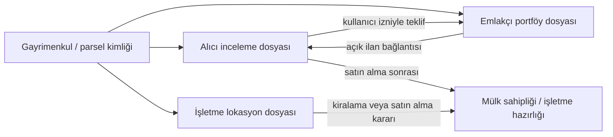
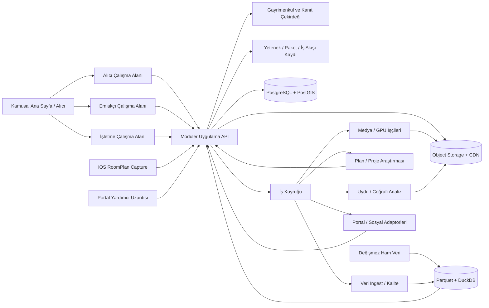

# Gayrimenkul Yaşam Döngüsü Platformu — Ürün ve Teknoloji Planı

## Yönetici özeti

Önerilen ürün, birbirinden kopuk üç araç değil, aynı **Gayrimenkul Veri Çekirdeği** üzerinde çalışan üç deneyimdir:

1. **Emlakçı Portföy Stüdyosu:** Portföy alma, doğrulama, bölge ve yatırım ön analizi, medya üretimi, çok kanallı ilan yayını, müşteri adayı ve satış/kiralama takibi.
2. **Alıcı Karar Merkezi:** İhtiyaç tanımı, ilan toplama, karşılaştırma, toplam maliyet, bölge ve ulaşım analizi, ziyaret planı, belge ve teklif kontrol listesi.
3. **İşletme Lokasyon OS:** Mağaza/ofis/depo lokasyonu seçimi, erişilebilirlik, rekabet ve çekim alanı, kira yükü ve gelir senaryosu, şube portföyü ve açılış karar odası.

Kamusal ana sayfa ve organik kullanıcı kazanımı **Alıcı Karar Merkezi** üzerinden başlamalıdır. İlk B2B gelir ürünü ise emlakçı aracı olabilir. Ancak ilk sürüm “her şeyi AI yapıyor” vaadiyle değil, şu dar ve güçlü sonuçlarla çıkmalıdır:

> Alıcı bir gayrimenkulü adres, ilan veya parsel üzerinden analiz eder; emlakçı portföyü bir kez girip çok kanallı yönetir; işletme aday lokasyonları ticari uygunluk açısından karşılaştırır. Üç deneyim aynı kaynaklı veri çekirdeğini kullanır fakat farklı kararları, yetkileri ve ekranları vardır.

Beş temel ürün kararı:

- **Değerleme tek fiyat değil aralık olmalı.** Emsal sayısı, veri tarihi ve güven düzeyi gösterilmeli; sonuç “SPK lisanslı değerleme” değil, kaynaklı bir ön analiz olarak sunulmalı. Emlakjet de kendi otomatik değerlemesini resmî ekspertiz olarak tanımlamıyor.[^1]
- **Rastgele birkaç fotoğraftan güvenilir gerçek 3B ev turu vaat edilmemeli.** İyi sonuç için yönlendirmeli video/360° çekim, odalar arası örtüşme ve kalite kontrol gerekir. Yetersiz çekimde ürün 360° tur veya fotoğraf tabanlı anlatımlı video üretmeli; sahte geometri oluşturmamalı.
- **Uydu videosu üretken AI videosu olmamalı.** Gerçek konum, gerçek lisanslı harita/uydu katmanı, gerçek POI ve rota verisi deterministik olarak render edilmeli; AI yalnız anlatım, müzik veya açıkça etiketli geçişlerde kullanılmalı. Google Aerial View API yalnız ABD adreslerini desteklediğinden Türkiye’de doğrudan çözüm değildir.[^2]
- **İlan yayını için önce resmî API/iş ortaklığı, sonra insan onaylı uzantı.** Hepsiemlak’ın resmî API’si ilan oluşturma, güncelleme ve yayınlamayı destekliyor.[^3] Emlakjet paneli ZIP/API anahtarıyla ilan transferini desteklediğini belirtiyor.[^4] Sahibinden’in açıkça belgelenen API akışı ise yayındaki ilanların, sözleşmeli ve EİDS’ye entegre firmalara dışarı aktarılmasıdır; bu belge Sahibinden’e dışarıdan yeni ilan yazma yetkisi verildiğini göstermiyor.[^5]
- **Sosyal paylaşım mevzuat akışının parçası olmalı.** 22 Ağustos 2026 tarihli Ticaret Bakanlığı açıklamasına göre sosyal medya taşınmaz ilanında EİDS doğrulanmış ilan bağlantısı ve fiyat bulunmalı; görsel ve açıklamalar aynı taşınmaza ait olmalı.[^6]

## 1. Ürün vizyonu ve sınırlar

### 1.1 Konumlandırma

Platformun ana vaadi “AI ile ilan yazmak” değildir. Bu kolay kopyalanır. Savunulabilir değer şudur:

- tek portföy kaydı;
- kaynaklı ve zaman damgalı bölge verisi;
- gerçek mülk özellikleriyle kilitlenmiş içerik üretimi;
- 3B/360° tur ve konum videosu;
- izinli kanallara yayın;
- yayın sonrası müşteri adayı, randevu ve performans döngüsü;
- emlakçı, alıcı ve işletme verilerinin aynı mülk kimliğinde birleşmesi.

Platform karar verirken kullanıcıyı destekler; hukuki, mühendislik veya SPK değerleme hizmetinin yerine geçmez. “Yatırım getirisi” bir sonuç vaadi olarak değil, varsayımları değiştirilebilir senaryo olarak gösterilir.

### 1.2 Ortak nesne: doğrulanabilir portföy dosyası

Her mülk için tek bir kanonik dosya tutulmalıdır:

- `property_id`: platform içi değişmez kimlik;
- konum: tam adres, yaklaşık yayın konumu, koordinat, il/ilçe/mahalle;
- taşınmaz numarası ve EİDS durumu;
- mülk tipi ve alt tipi;
- brüt/net m², oda, kat, yaş, cephe, ısıtma, kullanım durumu;
- fiyat, aidat, depozito, vergi ve işlem gideri varsayımları;
- malik beyanı, emlakçı beyanı, belgeyle doğrulanan bilgi ve model çıkarımı ayrı alanlarda;
- fotoğraf/video/360°/3B varlıkları;
- portal ilan kimlikleri ve yayın durumları;
- veri kaynağı, gözlem dönemi, toplama zamanı, kalite sınıfı ve güven skoru;
- revizyon ve onay geçmişi.

Doğru ayrım:

| Veri sınıfı | Örnek | Arayüz davranışı |
| --- | --- | --- |
| Doğrulanmış | Yetki belgesi, kullanıcı onaylı m², izinli kaynaktan rota | Kaynak ve tarih göster |
| Gözlemlenmiş | Portalda görülen ilan fiyatı | “İlan fiyatı” olarak etiketle |
| Türetilmiş | Brüt kira getirisi, geri dönüş süresi | Formül ve varsayımları aç |
| Projeksiyon | Gelecek kira/fiyat senaryosu | Tahmin bandı ve senaryo etiketi |
| Beyan | “Masrafsız”, “deniz manzaralı” | Beyanı kimin verdiğini göster |
| Demo | Arayüz örneği | Canlı üründe karar metriğine sokma |
| Karantina | Kaynağı veya üretimi güvenilmez eski veri | Kullanıcı sonucuna hiç katma |

### 1.3 Üç deneyim, tek platform

Platform üç bağımsız kullanıcı yolculuğu sunar:

| Çalışma alanı | Ana kullanıcı | Başlangıç nesnesi | Ana karar | Özel çıktılar |
| --- | --- | --- | --- | --- |
| Alıcı Karar Merkezi | bireysel/kurumsal alıcı | ilan, adres, ada/parsel, harita alanı | “Almalı mıyım, hangi şartlarda?” | karşılaştırma, fiyat bandı, risk/belge listesi, arsa kütle çalışması |
| Emlakçı Portföy Stüdyosu | danışman, ofis yöneticisi | yetkili portföy | “Nasıl hazırlar, yayınlar ve satarım/kiralarım?” | ilan paketi, medya, portal yayını, lead/randevu, malik raporu |
| İşletme Lokasyon OS | işletmeci, franchise, gayrimenkul/operasyon ekibi | aday lokasyon veya mevcut şube | “Bu lokasyonda iş sürdürülebilir mi?” | çekim alanı, rekabet, kira/ciro, ruhsat ihtiyacı, şube karşılaştırması |

Kamusal açılış sayfası alıcı deneyimidir. Üst navigasyonda **Alıcı**, **Emlakçı** ve **İşletme** girişleri bulunur. Kullanıcı aynı hesapla birden fazla çalışma alanına üye olabilir; rol değiştirdiğinde veri değil, amaç, yetki, menü ve çıktı şablonu değişir.

### 1.4 Ortak çekirdek ile ürüne özel modüllerin ayrımı

Ortak çekirdek yalnız bir kez geliştirilir:

- kimlik, kurum, ekip, üyelik ve rol;
- gayrimenkul/parsel/bina/bağımsız bölüm/lokasyon kimliği;
- adres, koordinat, poligon ve coğrafi katmanlar;
- kaynak, lisans, gözlem zamanı, veri kalitesi ve soy ağacı;
- belge, dosya, onay, yorum ve revizyon;
- emsal, değerleme, senaryo ve formül motoru;
- araştırma kanıtı, bildirim, görev, ödeme ve audit log;
- entegrasyon kasası ve API/portal bağlayıcıları.

Ürüne özel modüller ortak çekirdeğe bağlanır fakat birbirine doğrudan bağımlı olmaz:

- **Emlakçı:** portföy yetkisi, medya üretimi, yayın, CRM, randevu ve malik raporu;
- **Alıcı:** aday listesi, karşılaştırma, arsa/konut/dükkan incelemesi, teklif ve satın alma kontrolü;
- **İşletme:** iş modeli, çekim alanı, rekabet, şube senaryosu, ruhsat ve portföy performansı.

Bir modülün verisi diğer kullanıcı tipine kendiliğinden açılmaz. Örneğin emlakçının malik telefonu, alıcının özel bütçesi ve işletmenin POS verisi ortak gayrimenkul kimliğiyle ilişkili olsa bile ayrı çalışma alanlarında ve ayrı erişim politikalarında tutulur.

### 1.5 Gelecek özellikler için genişleme sözleşmesi

Yeni her özellik aşağıdaki sözleşmeyle eklenir:

```text
capability_key       benzersiz özellik kimliği
workspace_types      buyer | agency | business
asset_types          parcel | land | residence | commercial_unit | building | site
required_inputs      zorunlu veri ve kalite seviyesi
required_permissions kullanıcı/kurum yetkileri
processor_version    formül/model/iş akışı sürümü
output_schema        sürümlü yapılandırılmış sonuç
evidence_policy      kaynak ve doğrulama kuralları
entitlement_policy   paket, kota, kredi veya pilot erişimi
```

Arayüz menüleri, paket hakları ve iş akışları sabit `if userType` zincirleriyle değil bu yetenek kaydı üzerinden oluşur. Böylece örneğin “kredi senaryosu” alıcı ve emlakçıya farklı sunumla açılabilir; “gelişmiş fizibilite” yalnız arsa ve işletme paketlerine eklenebilir.

Her yeni özellik için zorunlu kapılar:

1. Kaynak ve lisans tanımı var mı?
2. Hangi kullanıcı tipi ve taşınmaz tipine ait?
3. Girdi yoksa reddetme/fallback davranışı nedir?
4. Sonuç resmî, gözlenen, türetilmiş veya projeksiyon mu?
5. Model/formül ve çıktı sürümleniyor mu?
6. Kim görebilir, paylaşabilir, dışa aktarabilir?
7. Maliyet, kota, saklama ve silme politikası nedir?
8. Eski rapor yeni model çıktısıyla sessizce değişiyor mu? Değişmemelidir; yeniden hesaplama yeni sürüm üretmelidir.

### 1.6 Ortak gayrimenkul yaşam döngüsü

Aynı taşınmaz üç farklı bağlamda ilerleyebilir:



Bu bağlantılar otomatik veri paylaşımı değildir. Çalışma alanları arasında teklif, belge veya iletişim aktarımı açık kullanıcı onayı, amaç sınırlaması ve audit kaydıyla yapılır.

### 1.7 Şimdiden ayrılacak gelecek yetenek alanları

İlk sürümde yapılmasa bile veri modeli ve navigasyonda yer ayrılacak modüller:

- **Finansman:** kredi uygunluk senaryosu, toplam finansman maliyeti, banka teklif karşılaştırması;
- **Uzman ağı:** lisanslı değerleme, hukuk, zemin/deprem, mimar, harita mühendisi ve ekspertiz talebi;
- **İşlem odası:** teklif, karşı teklif, belge listesi, görevler, e-imza sağlayıcısı ve güvenli ödeme/tapu yönlendirmesi;
- **Satın alma sonrası:** sigorta, abonelik, taşınma, tadilat, kiralama ve periyodik bakım;
- **Sürekli izleme:** fiyat, ilan, imar planı, proje, afet/tehlike ve altyapı değişiklik alarmı;
- **Geliştirici fizibilitesi:** tevhit/ifraz, terk, etap, inşaat maliyeti, bağımsız bölüm ve satış senaryosu;
- **Portföy yönetimi:** kira sözleşmesi, artış, tahsilat, boşluk, bakım ve performans;
- **Kurumsal/API:** white-label rapor, toplu aday yükleme, şirket SSO’su ve veri dışa aktarma;
- **Pazar yeri:** sponsorlu hizmetleri organik sonuçlardan açıkça ayıran uzman ve hizmet sağlayıcı alanı.

Bu yetenekler için bugün yalnız veri kimlikleri, izin modeli, olaylar ve eklenti noktaları hazırlanır; kullanılmayan modüllerin tamamı baştan inşa edilmez.

## 2. Birinci ürün: Emlakçı Portföy Stüdyosu

### 2.1 Uçtan uca iş akışı

#### A. Ofis kurulumu

- Ofis, marka renkleri, logo, danışmanlar ve yetkiler.
- TTYB/MYK bilgileri ve doğrulama durumu.
- Portal mağazaları, sosyal hesaplar ve paylaşım izinleri.
- Varsayılan iletişim kanalları, çalışma bölgeleri ve hizmet bedeli şablonları.
- KVKK aydınlatma, malik medya kullanım izni ve veri saklama politikası.

#### B. Portföy alma ve yetkilendirme

- Malik bilgisi, taşınmaz türü, amaç (satılık/kiralık), taşınmaz numarası.
- EİDS için adım adım yönlendirme; yetkinin başlangıç/bitiş tarihi.
- Yetkilendirme sözleşmesi, gösterme belgesi ve diğer evraklar için durum listesi. EİDS ilan verme yetkisi, emlakçının diğer sözleşme/belge yükümlülüklerinin yerine geçmez.[^7]
- Belge OCR yalnız alan doldurmayı önerir; kullanıcı onayı olmadan hukuki alan kesinleşmez.
- Tam adres sadece yetkili ekip ve randevusu onaylanmış kullanıcılarla paylaşılır; kamusal içerikte yaklaşık konum kullanılabilir.

#### C. Mülk bilgisi ve fotoğraf çekim asistanı

- Oda oda yönlendirme: kapıdan giriş, köşeler, pencere, sabit donanım, kusurlar, dış cephe ve bina girişi.
- Çekim kalite kontrolü: bulanıklık, düşük ışık, tekrar, aşırı HDR, ayna/yüz/plaka/kişisel belge tespiti.
- Fotoğraf sıralama: kapak, salon, mutfak, odalar, banyo, balkon, manzara, bina ve çevre.
- EXIF konumunun kamusal dışa aktarımdan temizlenmesi.
- “Sanal dekorasyon” ayrı bir çıktı olmalı; orijinal fotoğraf saklanmalı ve değişiklik açıkça etiketlenmeli.
- Yapısal kusurlar, manzara, oda ölçüsü ve malzeme AI tarafından icat edilmemeli.

#### D. Bölge ve yatırım ön analizi

Müşteriye sunulacak ana kartlar:

- satılık ve kiralık m² fiyat aralığı;
- benzer ilan aralığı ve örneklem büyüklüğü;
- aylık/yıllık fiyat değişimi;
- ilan stok adedi ve tahmini pazarda kalma süresi;
- brüt kira getirisi ve brüt geri dönüş süresi;
- gider girilmişse net kira getirisi;
- alternatif peşinat/kredi senaryoları;
- okul, sağlık, toplu taşıma, park, alışveriş ve iş merkezlerine yürüyüş/sürüş mesafesi;
- deprem **tehlikesi** ve kaynak bilgisi; “bina deprem riski” iddiası yok. AFAD açıkça tehlike haritasının risk haritası olmadığını ve yerel zemin etkilerini kapsamadığını belirtiyor.[^8]
- bölge trendi, ancak gerçekleşen veri ile projeksiyon ayrı serilerde.

Temel formüller:

```text
Brüt yıllık kira getirisi = (Aylık kira × 12) / Satış fiyatı
Brüt geri dönüş yılı = Satış fiyatı / (Aylık kira × 12)
Net kira getirisi = (Yıllık kira - boş kalma - aidat/vergi/bakım/sigorta) / toplam edinim maliyeti
Toplam edinim maliyeti = fiyat + vergi/harç + komisyon + zorunlu tadilat + finansman başlangıç maliyeti
Nakit getirisi = yıllık vergi öncesi nakit akışı / yatırılan özkaynak
```

Çıktı tek sayı vermemeli; iyimser, temel ve temkinli senaryoları göstermelidir. Veri azsa sistem sonuç üretmek yerine “yetersiz emsal” diyebilmelidir.

#### E. Medya üretimi

Her portföy için üretilecek paket:

1. **Web sunum sayfası:** fotoğraflar, gerçek/360°/3B tur, bölge kartları, harita ve danışman CTA.
2. **Paylaşılabilir PDF:** malik sunumu ve alıcı sunumu için iki ayrı sürüm.
3. **Portal bilgi görseli:** 4–6 doğrulanmış özellik, fiyat ve iletişim; portalın izin verdiği galeri/alan için boyutlandırılmış.
4. **İlan metni:** kısa başlık, uzun açıklama, özellik listesi, ulaşım notu, yasal ve veri tarihi dipnotu.
5. **10 saniyelik konum videosu:** gerçek harita/uydu tabanı, mülk pini, 2–4 önemli nokta ve gerçek rota/mesafe.
6. **Instagram paketi:** 4:5 carousel + 9:16 Reel/Story + açıklama.
7. **TikTok paketi:** 9:16 video, ilk 2 saniye kancası, altyazı ve açıklama.
8. **Facebook paketi:** 4:5 veya 16:9 görsel/video, daha açıklayıcı metin ve CTA.

Her sosyal pakette zorunlu kontrol alanları: fiyat, EİDS doğrulanmış ilan bağlantısı, danışman/ofis bilgisi, AI ile değiştirilmiş öğe etiketi ve yayın onayı. TikTok Content Posting API doğrudan yayın veya taslağa yükleme sunuyor; ancak uygulama onayı, kullanıcı yetkilendirmesi ve `video.publish`/`video.upload` kapsamları gerekiyor. Denetlenmemiş istemcilerin doğrudan gönderileri özel görünürlükle sınırlı.[^9] Instagram API profesyonel hesaplarda görsel, video, Reel ve carousel yayınlayabiliyor; medya yayın anında herkese açık bir sunucuda olmalı ve ilgili izinler alınmalı.[^10]

#### F. Yayın merkezi

- Tek içerikten portal bazlı alan eşleme.
- Her portal için kategori, zorunlu alan, görsel oranı, açıklama ve karakter sınırı profili.
- “Taslak üretildi → kullanıcı onayladı → portala gönderildi → moderasyonda → yayında → reddedildi → düzeltme bekliyor” durum makinesi.
- Portal ilan ID’si, URL’si, son senkronizasyon ve hata mesajı.
- Fiyat veya özellik değişince yalnız değişen alanların yeniden gönderimi.
- Yinelenen ilan ve eski sürüm uyarısı.
- Sosyal paylaşımın, doğrulanmış portal bağlantısı oluşmadan aktif olmaması.

#### G. Müşteri adayı ve satış/kiralama operasyonu

- Web formu, telefon, WhatsApp ve portal kaynak etiketleri.
- Tek müşteri kaydı ve yinelenen telefon/e-posta birleştirme.
- Otomatik ilk yanıt taslağı; gönderimden önce ofis politikası.
- Bütçe, taşınma tarihi, finansman ve tercihlerin yapılandırılmış kaydı.
- Randevu takvimi, rota ve gösterim planı.
- Ziyaret sonrası not, itiraz, teklif ve takip görevi.
- Malik raporu: görüntülenme, kaliteli talep, randevu, teklif, geri bildirim ve fiyat revizyon senaryosu.
- İYS/KVKK onayı olmayan kişiye pazarlama mesajı gönderilmemesi. Ticari elektronik iletilerde önceden onay ve ret/onay kayıt yükümlülüğü bulunuyor.[^11]

### 2.2 Konut, dükkân ve diğer gayrimenkul varyantları

| Alan | Konut | Dükkân/işyeri | Arsa/arazi |
| --- | --- | --- | --- |
| Temel değer | Yaşam, kira, erişim | Ciro potansiyeli, görünürlük, yaya/araç erişimi | İmar, geometri, çevre gelişimi |
| Ana metrik | Net/brüt getiri, toplam maliyet | Kira/ciro oranı, cephe, çekim alanı, rakip yoğunluğu | Alan, yol cephesi, plan durumu, kullanım kısıtı |
| POI | okul, sağlık, ulaşım, park | rakip, tamamlayıcı işletme, otopark, transit | yol, altyapı, merkez, sanayi/lojistik |
| Kritik belge | EİDS, tapu/iskan beyanları | ruhsat/kullanım, aidat, kiracı durumu | ada/parsel, plan notu, resmî imar durumu |
| Ana risk | hatalı bina/zemin iddiası | varsayımsal ciroyu garanti gibi sunma | otomatik/sentetik imar hakkı üretme |

Arsa modülünde mevcut depodaki geçmiş sentetik KAKS/TAKS/kat/bağımsız bölüm değerleri kesinlikle kullanılmamalıdır. Resmî/izinli kaynak başarısızsa alan boş kalmalı ve “doğrulanamadı” denmelidir.

### 2.3 Emlakçı V1 kapsamı

V1 emlakçı çalışma alanında bulunacaklar:

- ofis/danışman hesabı;
- portföy oluşturma ve taslak;
- fotoğraf yükleme ve kalite kontrol;
- kaynaklı mahalle/bölge raporu;
- kira getirisi ve üç senaryo;
- önemli noktalar ve gerçek mesafeler;
- ilan metni ve doğrulanmış özellik kartı;
- Instagram/TikTok/Facebook için dosya ve metin paketi;
- 10 saniyelik deterministik harita videosu;
- portal alan paketi ve kopyala/indir akışı;
- resmî entegrasyon bulunan kanallarda oluşturma/güncelleme/pasifleştirme;
- entegrasyon bulunmayan kanallarda insan onaylı Chrome yardımcı doldurma;
- izinli ve kullanıcı tarafından başlatılan fırsat ilan radarı;
- sonradan yüklenen fotoğraf/video için 360°, 2.5B, 3B veya sinematik fallback kalite sınıfları;
- EİDS/TTYB kontrol listesi;
- basit müşteri adayı ve randevu takibi;
- teklif, takip, malik performans raporu ve fiyat revizyon senaryosu;
- tüm çıktılarda insan onayı ve revizyon geçmişi.

Özellik V1’de yer alsa bile dış sistemin resmî yazma API’si yoksa “tam otomatik yayın” diye sunulmaz; yardımcı doldurma ve kullanıcı onayıyla tamamlanır. Yetersiz fotoğrafta gerçek 3B iddiası yerine kalite sınıfına uygun fallback üretilir.

## 3. 3B ev turu: seçenekler ve önerilen yol

### 3.1 Gerçeklik seviyesi

“Fotoğrafları yükle, gerçek 3B ev oluşsun” iki farklı ürünü birbirine karıştırır:

- **Görsel olarak etkileyici yeni bakış üretimi:** Eksik alanlarda iyi görünebilir fakat geometriyi ve detayları uydurabilir.
- **Ölçülebilir/dolaşılabilir dijital ikiz:** Kontrollü çekim, yeterli örtüşme, kamera pozları ve çoğu zaman derinlik/LiDAR ister.

Gayrimenkulde yanlış kapı, farklı pencere, büyümüş oda veya kaybolmuş kusur tüketiciyi yanıltabilir. Bu nedenle üretim zinciri üç kalite seviyeli olmalıdır.

### 3.2 Sonradan yüklenen mevcut fotoğraf ve videolardan üretim

Yönlendirmeli çekim bir kalite artırma seçeneğidir; ürünün kullanım şartı değildir. Emlakçı daha önce çekilmiş ilan fotoğraflarını, telefon videosunu veya portal için hazırladığı medya klasörünü sonradan yükleyebilmelidir. Sistem, çekimin biçimine göre mümkün olan en yüksek doğruluk sınıfını otomatik seçmelidir.

İşlem hattı:

1. Fotoğraf ve videolar aynı portföye yüklenir; video kaliteli ve farklı açılar içeren karelere ayrılır.
2. Bulanık, tekrar, ekran görüntüsü, filigranlı ve çok düşük çözünürlüklü varlıklar ayrılır; orijinaller silinmez.
3. Görüntüler salon, mutfak, oda, banyo, balkon ve dış cephe gibi sahnelere kümelenir. Birbirine benzeyen iki farklı oda otomatik birleştirilmez; düşük güvende kullanıcıya sorulur.
4. EXIF/kamera bilgisi varsa korunur; yoksa kamera iç parametreleri tahmin edilir.
5. VGGT gibi bir model ilk kamera pozlarını, derinliği ve 3B noktaları çıkarır; yeterli eşleşme varsa COLMAP/bundle adjustment ile geometri iyileştirilir.
6. Her oda için görüş kapsaması, fotoğraflar arası örtüşme, reprojection/geometri tutarlılığı ve görünmeyen alan oranı hesaplanır.
7. Kalite kapısı sonucuna göre aşağıdaki çıktılardan biri üretilir.

| Otomatik çıktı sınıfı | Medyada aranan koşul | Kullanıcıya sunulan sonuç |
| --- | --- | --- |
| A — Çok görüşlü 3B | Aynı odanın farklı konumlardan yeterli örtüşen görüntüsü veya yürüyüş videosu | Gaussian Splat tabanlı dolaşılabilir tur |
| B — AI destekli 360° | Odanın çevresini büyük ölçüde kapsayan fakat aralarında boşluk bulunan fotoğraflar | Birleştirilmiş panorama; üretilen bölgeler açıkça işaretli |
| C — Derinlikli 2.5B | Az sayıda ve örtüşmesi zayıf kaliteli fotoğraf | Fotoğraf içinde sınırlı kamera hareketi/paralaks ve hotspot geçişi |
| D — Sinematik fotoğraf turu | 3B için yetersiz veya tek açıdan medya | Ken Burns/kamera hareketi, metin, plan ve sesli anlatım; 3B iddiası yok |

Sistem her yüklemede kullanılabilir bir medya paketi üretmeye çalışır; fakat her girdiye “360°” veya “gerçek 3B” etiketi vermez. Kullanıcı sonuç ekranında şu bilgileri görür:

- oda bazında kapsama yüzdesi;
- doğrudan fotoğraftan gelen alanlar;
- AI ile tamamlanan/görünmeyen alanlar;
- yaklaşık derinlik ile ölçülebilir derinlik ayrımı;
- yeniden çekilirse kaliteyi yükseltecek 1–3 eksik açı;
- mevcut çıktı sınıfı ve neden daha yüksek sınıfa geçemediği.

Tek bir eski yürüyüş videosu, kareler arasında kamera hareketi ve örtüşme bulunduğu için çoğu zaman birbirinden bağımsız birkaç fotoğraftan daha değerlidir. Buna karşılık aynı noktadan yalnız sağa-sola dönülerek çekilmiş video panorama için uygundur, fakat güvenilir metrik derinlik için yeterli paralaks sağlamaz.

Üretken AI yalnız fotoğraflarda hiç görünmeyen bölgeleri görsel olarak tamamlamak için kullanılabilir. Bu bölgeler gerçek mülk kanıtı sayılmaz; orijinal görüntü, AI maskesi ve son çıktı birlikte saklanır. Kapı, pencere, oda büyüklüğü, manzara veya kusur gibi yapısal özellikler AI tahminiyle doğrulanmış bilgiye dönüştürülmez.

### 3.3 Seçenek A — 360° tur, V1 güvenli taban

- Emlakçı odanın merkezinde telefon/360 kamera ile panorama çeker.
- Pannellum veya Marzipano ile hotspot’lu oda geçişleri oluşturulur; ikisi de web tabanlı açık kaynak görüntüleyicilerdir.[^12]
- Kat planı varsa hotspot’lar plana bağlanır.
- Düşük maliyet, hızlı sonuç ve düşük geometri riski.
- Dezavantaj: serbest 6DoF dolaşım ve gerçek “dollhouse” görünümü yok.

### 3.4 Seçenek B — yönlendirmeli video + Gaussian Splat, V1 gelişmiş çıktı

İşlem hattı:

1. Mobil uygulama oda oda video çektirir; hareket hızı, örtüşme, ışık ve bulanıklığı anlık denetler.
2. Videodan kaliteli kareler seçilir; yüz, ekran, aile fotoğrafı ve belgeler bulanıklaştırılır.
3. COLMAP veya uygun bir görsel geometri modeli kamera pozlarını ve seyrek yapıyı çıkarır. COLMAP yeni BSD lisanslıdır.[^13]
4. Nerfstudio Splatfacto/gsplat sahneyi eğitir; Nerfstudio Apache-2.0 lisanslıdır ve Splatfacto `.ply` splat dışa aktarabilir.[^14]
5. SuperSplat ile gürültü temizlenir, başlangıç kameraları/hotspot’lar eklenir ve web için sıkıştırılır; editör ve viewer MIT lisanslıdır.[^15]
6. Otomatik kalite kapısı başarısızsa ürün gerçek 3B etiketi kullanmaz ve 360°/video çıktısına düşer.

VGGT, bir veya çok sayıda görüntüden kamera parametreleri, derinlik, nokta haritası ve 3B izleri saniyeler içinde çıkarabilen güçlü bir hızlandırıcı adaydır.[^16] Fakat ticari üründe yalnız özel **VGGT-1B-Commercial** checkpoint’i kullanılabilir; orijinal checkpoint ticari değildir ve erişim başvurusu gerekir.[^17] DUSt3R ve MASt3R araştırma için değerlidir, ancak yayımlanmış checkpoint/lisansları ticari kullanımı kısıtlayabildiği için doğrudan SaaS bağımlılığı yapılmamalıdır.[^18]

### 3.5 Seçenek C — ticari dijital ikiz

- Matterport hesabı ve yakalama akışı kullanılır.
- Tur platforma gömülür; Model API ile paylaşım URL’si, görsel, video, panorama, nokta ve satın alınmış mesh/point cloud varlıklarına erişilebilir.[^19]
- En hızlı premium kalite ve operasyon desteği.
- Dezavantaj: portföy başına/abonelik maliyeti, tedarikçi bağımlılığı ve veri/şart kısıtları.

### 3.6 LiDAR ve kat planı

- LiDAR’lı iPhone/iPad için Apple RoomPlan; duvar, kapı, pencere ve tanınan mobilyaları ölçülü USD/USDZ çıktısına dönüştürebilir, birden çok odayı tek yapıda birleştirebilir.[^20]
- Android’de ARCore Depth destekli cihazlarda hareketten ve varsa donanım sensöründen derinlik alınabilir; doğruluk mesafe ve yüzey dokusuna bağlıdır.[^21]
- CubiCasa benzeri ticari servisler kat planı ve dışa aktarma API’si için değerlendirilebilir.[^22]

**V1 kararı:** A, B ve C aynı kalite yönlendirme sisteminde bulunur. Standart pakette 360°/2.5B fallback; yeterli görüntüde Gaussian Splat; premium pakette Matterport ve desteklenen cihazlarda RoomPlan seçeneği sunulur. Her portföy girdi kalitesine göre doğru sınıfa düşer; paket satın almak eksik görüntüyü “gerçek 3B” yapmaz.

## 4. Uydu/konum videosu: doğru teknik çözüm

### 4.1 Önerilen 10 saniyelik storyboard

```text
0.0–2.0 sn  Şehir/ilçe geniş plan, gerçek uydu veya 3B karo
2.0–4.0 sn  Kamera mülke yaklaşır, parsel/bina pini belirir
4.0–8.0 sn  2–4 önemli noktaya rota çizgileri ve süre/mesafe etiketleri
8.0–10 sn   Fiyat + ana özellik + doğrulanmış ilan bağlantısı/QR + danışman CTA
```

### 4.2 Render mimarisi

- Google Map Tiles API veya lisanslı alternatiften uydu/Photorealistic 3D Tiles; API hem 2B uydu hem fotogerçekçi 3B karolara erişim sağlıyor, ancak kapsama ve maksimum yakınlaştırma konuma göre değişiyor.[^23]
- Kapsama varsa CesiumJS/3D Tiles; yoksa MapLibre + uydu raster + DEM + bina/parsel/POI katmanları.
- Google Places Nearby Search veya izinli POI kaynağı ile okul, hastane, transit, park vb.; Places sonuç ve saklama/atıf politikaları uygulanmalı.[^24]
- Routes API Compute Routes/Route Matrix ile gerçek yol mesafesi ve süre; düz çizgi “mesafe” ayrıca açıkça etiketlenebilir.[^25]
- Headless Chromium/WebGL ile kare üretimi; Remotion/FFmpeg ile dikey ve yatay MP4.
- Her videoda veri tarihi ve harita atfı.

### 4.3 AI nerede kullanılmalı?

- metin/seslendirme taslağı;
- müzik ve tempo seçimi;
- açıkça “AI üretimi” etiketli giriş/çıkış;
- gerçek uydu karesinden sonra ayrı bir sinematik geçiş.

AI süper çözünürlük, mevcut pikselleri görsel olarak iyileştirebilir ama gerçekte bulunmayan bina/cephe/çevre ayrıntısını kanıt olarak üretemez. “Yüksek çözünürlüklü uydu” ifadesi yalnız lisanslı kaynağın gerçek çözünürlüğü için kullanılmalıdır.

## 5. İlan portalı ve Chrome uzantısı stratejisi

### 5.1 Entegrasyon önceliği

| Yöntem | Güvenilirlik | Operasyon | Öneri |
| --- | --- | --- | --- |
| Resmî yazma API’si | Yüksek | Alan eşleme, OAuth/API anahtarı, webhook | İlk tercih |
| Portalın ZIP/XML/API transferi | Orta-yüksek | Partner sözleşmesi ve EİDS uyumu | İkinci tercih |
| CRM/entegratör ortaklığı | Orta-yüksek | Gelir paylaşımı/iş ortaklığı | Hızlı pazara giriş |
| Chrome “yardımcı doldurma” | Orta-düşük | DOM değişikliği, oturum, doğrulama | API yoksa insan onaylı köprü |
| Tam otomatik tarayıcı robotu | Düşük | CAPTCHA, şart ihlali, hesap riski | Ürün omurgası yapılmamalı |

### 5.2 Chrome uzantısıyla güvenli olarak yapılabilecekler

- Emlakçı kendi hesabında ilan verme sayfasını açar.
- Uzantı portföyü seçtirir ve portal alanlarıyla eşleşmeyi gösterir.
- Başlık, açıklama, özellikler ve konum kullanıcıya önizletilir.
- Görseller doğru sıra ve boyutta hazırlanır; tarayıcı izin veriyorsa seçime yardımcı olur.
- Eksik/zorunlu alanlar işaretlenir.
- Taslak kaydedilir; nihai “Yayınla” işlemi kullanıcı onayına bırakılır.
- Portal yanıtı ve ilan URL’si ürün kaydına geri yazılır.

Yapılmaması gerekenler:

- şifre/çerez/oturum anahtarı toplamak;
- CAPTCHA veya erişim kontrolünü aşmak;
- gizli/tersine mühendislik edilmiş uçları sunucu ürünü gibi kullanmak;
- portalın açık izni olmadan kitlesel ilan veya veri toplamak;
- kullanıcı görmeden fiyat, adres veya EİDS alanını göndermek.

Mevcut uzantı altyapısı okuma ve yerel veri yakalama deneyimi sağlar; ancak otomatik sayfalama izin kapısı, güvenlik kontrolünde durma ve canlı DOM’u yeniden test etme kuralları korunmalıdır. Yayın uzantısı mevcut toplayıcıdan ayrı izinlere ve ayrı bir güvenlik modeline sahip olmalıdır.

### 5.3 Portal bazlı ilk karar

- **Hepsiemlak:** Resmî API için entegrasyon başvurusu; ilk gerçek otomatik yayın pilotu.
- **Emlakjet:** Yönetim Paneli transferi/API anahtarı akışını iş ortaklığıyla doğrula; ikinci otomatik kanal.
- **Sahibinden:** Önce ticari/teknik partner görüşmesi ve EİDS entegratör koşulları. Anlaşma olmadan yalnız “ilan paketi indir + yardımcı doldur + kullanıcı yayınlasın”. Sahibinden’in belgelenen erişim anahtarı yalnız seçilen, sözleşmeli ve EİDS entegre firmaya verilmelidir.[^5]
- **Sosyal:** Instagram/TikTok/Facebook bağlantıları OAuth ile, hesap sahibi onayı ve gönderi önizlemesiyle; fiyat ve doğrulanmış ilan linki zorunlu.

## 6. İkinci ürün: Alıcı Karar Merkezi

### 6.1 Ana problem

Alıcının sorunu ilan bulmak değil; yüzlerce ilan arasından hangisinin gerçek, uygun, erişilebilir ve toplam maliyet açısından taşınabilir olduğunu anlamaktır.

### 6.2 Ana sayfa ve giriş akışı

Site ilk açıldığında varsayılan ekran **Alıcı Sayfası** olur. Üstte üç büyük seçim bulunur:

1. **Arsa analizi**
2. **Konut analizi**
3. **Dükkan/işyeri analizi**

Alıcı ilan bağlantısı, ada/parsel, adres veya haritada nokta/poligon ile başlayabilir. Aynı kullanıcı birden fazla adayı kaydedip yan yana karşılaştırabilir. Emlakçı ve işletme araçları ana navigasyonda bulunur; ancak ürünün ilk çağrısı “Almayı düşündüğünüz gayrimenkulü analiz edin” olur.

Alıcı ürününde 3B tur, sosyal medya paketi veya tanıtım videosu üretilmez. Hesaplama, kanıt, harita, belge ve karşılaştırma önceliklidir.

### 6.3 Ortak alıcı modülleri

1. **İhtiyaç brifi:** bütçe, peşinat, aylık ödeme sınırı, zaman ufku, kullanım/yatırım amacı ve vazgeçilmezler.
2. **Aday kutusu:** ilan linki, ada/parsel, adres veya kullanıcı tarafından çizilen alan. İzinli portal/partner bağlantısı varsa ilan alanları içe alınır; kaynak ve son görülme zamanı tutulur.
3. **Emsal ve fiyat bandı:** benzer gayrimenkuller, bölge m² dağılımı, ilan tarihi, aykırı değerler, örneklem büyüklüğü ve güven aralığı.
4. **Toplam edinim maliyeti:** ilan/satın alma bedeli yanında tapu, finansman, tadilat, altyapı ve senaryoya özel giderler.
5. **Belge ve risk odası:** kullanıcı belgesi, resmî kaynak, satıcı/ilan beyanı, model türetimi ve eksik bilgi birbirinden ayrılır.
6. **Karşılaştırma:** 3–5 aday için fiyat, kullanım uygunluğu, riskler, eksikler ve doğrulanacaklar.
7. **Araştırma dosyası:** resmî plan/duyuru, güvenilir haber ve proje sayfası kanıtları; URL, yayın tarihi, erişim tarihi, kapsanan alan ve güven sınıfıyla saklanır.
8. **Ziyaret ve teklif:** kontrol listesi, notlar, hedef fiyat, üst sınır ve şartlı teklif taslağı; otomatik pazarlık veya otomatik hukuki kanaat verilmez.

### 6.4 Arsa Analiz Motoru

#### 6.4.1 Parsel seçimi ve yüksek çözünürlüklü harita

- Google Maps uydu/hybrid görünümü üzerinde parsel poligonu, köşe noktaları, alan, çevre, cephe ve ölçüler gösterilir. Maps JavaScript API poligon katmanlarını ve alan/mesafe hesaplarını destekler.[^36]
- Google görüntüsü kadastro sınırı değildir. Poligon önce lisanslı/resmî kadastro kaynağından gelir; bulunamazsa kullanıcı çizer veya koordinat dosyası yükler. Kaynak ve ölçüm hassasiyeti ekranda görünür.
- TKGM Parsel Sorgu; ada/parsel, konum, alan ve bazı özniteliklere erişim sağlar, ancak otomatik toplama ve ticari yeniden kullanım hakkı ayrıca doğrulanmalıdır.[^28]
- Brüt tapu alanı, hesaplanan geometri alanı ve varsa imar uygulaması sonrası net alan ayrı gösterilir; birbirinin yerine kullanılmaz.

#### 6.4.2 Arsa şekli ve fiziksel kullanılabilirlik

Algoritma aşağıdaki özellikleri hesaplar:

- kompaktlık, en-boy oranı, dar boğazlar ve üçgensel/kayıp alanlar;
- yola cephe uzunluğu, parsel derinliği, köşe parsel durumu ve cephe yönü;
- eğim, bakı, kot farkı ve tahmini kazı/dolgu etkisi;
- çekme mesafeleri uygulandıktan sonra kalan yapı yaklaşma zarfı;
- irtifak, enerji hattı, dere, kıyı, koruma, orman, tarım, sit veya kamulaştırma gibi doğrulanması gereken kısıtlar;
- mevcut yapı/örtü, çevredeki yapı yoğunluğu ve parselle erişim ilişkisindeki veri uyuşmazlıkları.

“Haritada yol görünüyor” ile **hukuken yola cepheli** aynı sonuç değildir. Görsel yol, rota verisi, kadastro yolu ve imar planındaki yol ayrı alanlarda gösterilir.

#### 6.4.3 İmar ve planlama analizi

Kaynak önceliği: yürürlükteki 1/1000 uygulama imar planı ve plan notu → 1/5000 nazım plan → 1/25.000 ve 1/100.000 üst ölçek plan → belediye/e-Plan askı ve değişiklik duyuruları. e-Plan, mekânsal planların coğrafi ve sözel verilerini dijital arşivde toplamayı amaçlıyor; yine de son hukuki durum ilgili idareden imar durum belgesiyle doğrulanır.[^37]

Çıkarılacak alanlar:

- kullanım kararı ve yapı nizamı;
- TAKS, KAKS/emsal, Yençok/Hmax ve kat sınırı;
- ön/yan/arka çekme mesafeleri;
- minimum ifraz koşulu ve parsel büyüklüğü;
- terk, DOP, yol/park/kamu alanı etkisi;
- etap, plan notu, özel proje alanı ve kurum görüşü şartları;
- planın onay, askı, itiraz ve kesinleşme durumu.

Plan paftası OCR/AI ile okunabilir; ancak AI çıkarımı “taslak okuma” sayılır. Kullanıcıya pafta, plan notu ve ilgili madde birlikte gösterilmeden doğrulanmış imar değeri üretilmez.

#### 6.4.4 İmarlı arsa için örnek proje

Yalnız doğrulanmış imar girdileri yeterliyse parametrik bir **ön kütle çalışması** oluşturulur:

```text
net_imar_parseli = brüt_alan - doğrulanmış_terk_kayıpları
azami_emsal_alani = net_imar_parseli × KAKS
azami_taban = min(net_imar_parseli × TAKS, çekmeler_sonrası_yapı_zarfı)
yaklaşık_kat_senaryosu = azami_emsal_alani / kullanılabilir_taban
```

Çıktı; çekme sınırları, yaklaşık taban oturumu, kat/emsal dağılımı, otopark/çekirdek/ortak alan varsayımları ve 2B/3B basit kütle modelidir. Brüt-net satılabilir alan ve bağımsız bölüm sayısı tek sonuç değil, senaryo aralığı olur. Bu çalışma mimari proje, ruhsat uygunluğu, imar çapı veya resmî değerleme değildir.

#### 6.4.5 On yıllık yaz-kış uydu zaman çizgisi

İki ayrı görüntü ürünü sunulur:

- **Güncel yakın görünüm:** lisans koşulları içinde Google Maps satellite/hybrid tabanı.
- **Tarihsel karşılaştırma:** her yıl için bulutsuz yaz ve kış bileşimi; aynı kırpım, aynı ölçek ve aynı poligonla toplam 20 dönem.

Standart Google Maps katmanı tarih seçmeli on yıllık arşiv API’si olarak ele alınmamalıdır. Tarihsel seri için Sentinel-2 harmonize arşivi kullanılabilir: 2015’ten günümüze küresel veri, görünür/NIR bantlarda 10 m çözünürlük ve yaklaşık beş günlük tekrar sağlar.[^38] Daha uzun dönem veya geniş ölçekli kent büyümesi için Landsat arşivi 1980’lere uzanır, fakat çözünürlüğü parsel ayrıntısından çok bölgesel değişime uygundur.[^39] Küçük parsellerde 10 m görüntü yalnızca çevresel değişimi gösterebilir; geçmişe dönük metre-altı görüntü gerekiyorsa lisanslı ticari sağlayıcı ayrıca fiyatlanır.

Zaman çizgisinden türetilecek göstergeler:

- yapılaşmış alan artışı ve boş parsel kaybı;
- yeni yol/şantiye/büyük yapı oluşumu;
- bitki ve çıplak toprak değişimi;
- yüzey suyu/nem göstergesi ve mevsimsel değişim;
- yangın/taşkın/erozyon sonrası belirgin değişiklik;
- görüntü bulutluluğu, sensör çözünürlüğü ve değişim güveni.

Uydu görüntüsü mülkiyet, imar hakkı, yeraltı suyu veya zemin taşıma gücü kanıtı değildir.

#### 6.4.6 Su, yol, altyapı ve erişim

- İçme suyu, kanalizasyon, elektrik, doğalgaz ve fiber için ilgili belediye/altyapı işletmesinin hizmet veya bağlantı teyidi aranır.
- DSİ havza ve yeraltı suyu gözlem verileri bölgesel bağlam sağlar; parselde kuyu açılabileceği ya da su bulunduğu sonucu üretmez. DSİ, havza bazında yeraltı suyu seviye gözlem kuyusu serileri yayımlıyor.[^40]
- Dere yatağı, taşkın, kıyı ve sulama alanı göstergeleri ayrı risk bayraklarıdır.
- Mevcut yolun yüzeyi/genişliği, en yakın ana yol, güzergâh süresi ve ağır araç erişimi gösterilebilir; hukuki geçit ve cephe durumu tapu/kadastro/plan belgesiyle doğrulanır.
- Altyapı için “var”, “görselde görülüyor”, “yakında”, “başvuru gerekli” ve “bilinmiyor” durumları birbirinden ayrılır.

#### 6.4.7 Zemin, jeoloji ve doğal tehlike

- eğim, yükseklik, jeoloji, heyelan, diri fay yakınlığı, deprem tehlikesi, taşkın ve sıvılaşma konusunda mevcut resmî/bölgesel katmanlar üst üste getirilir;
- MTA verisi bölgesel ön inceleme olarak kullanılır; MTA da harita görüntüleyici verilerinin teknik ve insan hayatını ilgilendiren çalışmalarda resmî belge olmadığını belirtiyor.[^41]
- AFAD Türkiye Deprem Tehlike Haritası bir **risk haritası değildir**; parsel zemin sınıfı veya bina performansı yerine geçmez.[^42]
- “zemin uygun/uygunsuz” hükmü verilmez. Jeolojik-jeoteknik etüt, sondaj ve ilgili uzman doğrulaması gereken konular açıkça listelenir.

#### 6.4.8 Şehrin büyüme yönü ve gelecek projeler

İki farklı sinyal birlikte fakat karıştırılmadan sunulur:

1. **Gözlenen büyüme:** uydu zaman serisinden yapılaşma sınırının hareketi, yol ağı artışı, yeni yapı kümeleri; nüfus, yapı ruhsatı ve ilan yoğunluğu değişimi.
2. **Planlanan büyüme:** üst ölçek plan kararları, belediye meclisi/imar askı ilanları, ulaşım ve altyapı yatırımları, kamulaştırma/ihale/ÇED duyuruları ve resmî kurum proje sayfaları.

İnternet araştırma ajanı parsel koordinatı, mahalle, ilçe ve proje anahtar kelimeleriyle tarama yapar. Her bulgu şu sınıflardan biri olur: `resmen_onayli`, `askida_itiraz_acik`, `ihale_edildi`, `duyuruldu`, `haber_iddiasi`, `eski_veya_iptal`. Bir haber veya satış ilanındaki “metro gelecek” ifadesi fiyat modeline doğrulanmış proje gibi girmez.

#### 6.4.9 Algoritmik arsa fiyatlama

Tek rakam yerine P10/P50/P90 değer aralığı ve açıklanabilir düzeltmeler üretilir:

```text
taban_m2 = zaman + mesafe + alan + kullanım bakımından ağırlıklı emsal medyanı
nihai_aralik = taban_m2
  × imar_hakki_duzeltmesi
  × sekil_cephe_egim_duzeltmesi
  × yol_altyapi_duzeltmesi
  × plan_gelisim_duzeltmesi
  × zemin_tehlike_belirsizlik_duzeltmesi
```

Model girdileri:

- aynı imar kullanımındaki yakın ve güncel emsaller;
- alan/fiyat eğrisi ve parsel büyüklüğü etkisi;
- planla doğrulanmış yapılaşabilir emsal alanı;
- şekil, cephe, köşe, eğim ve yapı zarfı verimliliği;
- hukuki ve fiilî yol erişimi;
- altyapı bağlantı durumu;
- üst ölçek plan ve doğrulanmış proje etkisi;
- tarihsel yapılaşma yönü;
- tehlike katmanları ve özellikle veri eksikliği.

Gerçekleşmiş satış bedeli yoksa ilan fiyatı “satış emsali” diye sunulmaz. Kaynak sayısı az, imar belirsiz veya poligon güvensizse model fiyat vermeyi reddedebilir; yalnız bölge ilan bandını gösterir. Her düzeltmenin yönü, etkisi, veri tarihi ve güveni kullanıcıya açıklanır.

### 6.5 Konut analizi

- fiyat/m² ve benzer konut bandı;
- toplam edinim, finansman, aidat ve olası tadilat senaryosu;
- bina yaşı, kat, cephe, gün ışığı ve alan beyanlarının doğrulama listesi;
- deprem tehlike bağlamı ile bina/zemin performansının ayrılması;
- ulaşım, okul/iş noktaları ve günlük yaşam süreleri;
- kira getirisi, boş kalma/bakım varsayımı ve farklı fiyat senaryoları;
- iskan, kat mülkiyeti/irtifakı, aidat ve tadilat belgesi kontrolü.

### 6.6 Dükkan/işyeri analizi

- kullanım amacı, ruhsat sınıfı ve imar uygunluğu kontrol listesi;
- cephe, görünürlük, yaya/araç erişimi, toplu taşıma ve otopark;
- rakip ve tamamlayıcı işletme yoğunluğu;
- tahmini kira/ciro eşiği ve başabaş senaryosu;
- baca, elektrik gücü, yükleme, depo, erişilebilirlik ve çalışma saati ihtiyaçları;
- gündüz/gece çekim alanı ve yeni gelişim göstergeleri;
- mevcut kiracı, tahliye, aidat, ortak alan ve yönetim planı belgeleri.

### 6.7 Alıcı çıktısı

- haritalı ve kaynak bağlantılı gayrimenkul karar raporu;
- 3–5 aday karşılaştırma tablosu;
- P10/P50/P90 fiyat aralığı, emsaller ve model açıklaması;
- “resmî / gözlenen / beyan / türetilmiş / eksik / doğrulanacak” özeti;
- toplam maliyet ve kullanım/yatırım senaryoları;
- arsa için 20 dönemlik yaz-kış uydu zaman çizgisi;
- imarlı arsa için doğrulanmış girdilere bağlı ön kütle çalışması;
- ziyaret, belge ve uzman kontrol listesi;
- paylaşılabilir aile/ortak karar bağlantısı.

### 6.8 Gelir modeli

- ücretsiz ilan kutusu ve sınırlı karşılaştırma;
- tek seferlik ayrıntılı karar raporu;
- aile/çift ortak karar paketi;
- ekspertiz, sigorta, kredi ve taşınma yönlendirmelerinde açık sponsor/komisyon beyanı;
- emlakçıdan ücret alan ilanların organik sıralamayla karışmaması.

## 7. Üçüncü ürün: İşletme Lokasyon OS

### 7.1 Hedef kullanıcılar

- perakende ve franchise markaları;
- kafe/restoran;
- klinik, eğitim ve hizmet işletmeleri;
- ofis arayan şirketler;
- depo, mikro-depo ve lojistik operasyonları;
- birden çok şubesi olan işletmeler.

### 7.2 Modüller

1. **Lokasyon brifi:** iş modeli, hedef müşteri, m², bütçe, cephe, otopark, teslimat ve ruhsat ihtiyaçları.
2. **Aday alan taraması:** il/ilçe/mahalle ve grid bazında ön eleme.
3. **Çekim alanı:** yürüyüş/sürüş süre halkaları, nüfus ve gündüz nüfusu için izinli/anonim göstergeler.
4. **Rekabet ve tamamlayıcı POI:** rakip sayısı, kümelenme, anchor işletmeler, ulaşım ve otopark.
5. **Ticari erişim:** yaya/araç erişimi, toplu taşıma, ana yol, yükleme ve son kilometre.
6. **Ekonomi senaryosu:** kira/ciro oranı, başabaş ciro, personel/lojistik varsayımı, yatırım geri ödeme senaryosu.
7. **Ruhsat ve imar kontrol listesi:** otomatik “uygundur” sonucu değil, resmî kurumdan doğrulanacak alanlar ve belge iş akışı.
8. **Şube karşılaştırma ve kannibalizasyon:** mevcut şubeler, aday lokasyonlar ve hizmet alanı çakışmaları.
9. **Portföy ve sözleşme yaşam döngüsü:** kira artış tarihi, depozito, tadilat dönemi, yenileme ve çıkış takvimi.
10. **Gerçek performans geri beslemesi:** işletme isterse anonimleştirilmiş POS/ziyaret/teslimat verisini getirir; model tahminleri gerçekleşen sonuçla kalibre edilir.

### 7.3 Alt ürün seçenekleri

- **Retail Site Selector:** mağaza/kafe için hızlı skor ve shortlist.
- **Office Fit:** çalışan ikamet kümeleri, toplu taşıma ve toplam işveren maliyeti.
- **Logistics Fit:** depo, yol erişimi, teslimat süresi ve bölgesel talep.
- **Portfolio Control Tower:** mevcut şubelerin kira, sözleşme, bakım ve performans yönetimi.

İlk ticari dikey olarak **kafe/restoran** veya **mağaza/franchise** seçilmesi önerilir; geri bildirim döngüsü ve somut lokasyon kararları daha hızlıdır. Depo/lojistik ikinci uzmanlaşma olabilir.

## 8. Elimizde bugün ne var?

Mevcut checkout ve envanter incelemesine göre:

### 8.1 Kullanılabilir temel

- Emlakjet bölge endeksi için Türkiye → il → ilçe → mahalle hiyerarşisi ve konut/arsa ayrımı.
- Bölge kaydında m² fiyat min/ortalama/maksimum, ortalama fiyat ve m², ilan sayısı, aylık/yıllık değişim, amortisman, getiri, bina yaşı, ilan süresi, kira m²/fiyat ve kaynak/dönem/toplanma zamanı dahil 31 alan.
- 2021’den itibaren aylık trend ve gerçekleşen/projeksiyon ayrımı için alan.
- Fiyat/ilan dağılımları: bina yaşı, oda, kat, ısıtma ve alan kırılımları.
- 55 CSV, 9 SQLite/DB ve 1.061 JSON/GeoJSON dosyası.
- 51.171 mahalle koordinatı; 52.151 poligon kaydı; 81 il + 973 ilçe parçası.
- ZIP arşivlerinde tekrarlar dahil yaklaşık 5,99 milyon satır; birleşik pakette yaklaşık 2,45 milyon satır.
- POI, ofis, lojistik, demografi ve çeşitli ticari gösterge toplayıcıları.
- Chrome uzantısında yerel IndexedDB, duraklat/devam, rate limit ve CSV dışa aktarma örüntüsü.
- MapLibre tabanlı parsel/POI/uydu demosu ve 3B eğimli kamera başlangıcı.
- Güvenlik testleri ve veri envanteri aracı.

### 8.2 Ürüne alınmadan önce düzeltilmesi gerekenler

- Ana birleşik paket 81 değil 76 ili içeriyor; Batman, Şırnak, Ardahan, Iğdır ve Kilis ayrı paketlerde.
- İl tablosunda 15 kat tekrar gibi doğal anahtar sorunları var.
- Eski imar, KAKS/TAKS/kat ve bağımsız bölüm alanlarının bir bölümü sentetik; karantinada kalmalı.
- Ticari istihbarat alanlarının bir kısmı sabit katsayı/model; “resmî” veya “güncel” olarak kullanılamaz.
- 2027-08 gibi projeksiyon dönemlerinin gerçekleşmiş fiyat özetine karışması
  Silver `entity_contracts_v3` tarih kontrolü ve Gold denetim görünümüyle giderildi.
- İlan akışının beklediği `localhost:3001` backend’i bu checkout’ta yok.
- Kök ve `collector/` altında yinelenen kodlar var; büyük tek dosyalar bakım maliyetini artırıyor.
- Portal verilerinin ticari yeniden kullanım lisansları ve canlı uç sözleşmeleri ayrı ayrı doğrulanmalı.

### 8.3 Henüz olmayan kritik ürün parçaları

- çok kiracılı kullanıcı/ofis/danışman yetkileri;
- kanonik PostgreSQL/PostGIS şeması ve veri soy ağacı;
- dosya/object storage, CDN ve yaşam döngüsü silme kuralları;
- medya iş kuyruğu ve GPU çalışma altyapısı;
- EİDS/TTYB durum yönetimi;
- portal yazma entegrasyonları;
- sosyal OAuth ve yayın iş akışı;
- gerçek 360°/3B yakalama uygulaması;
- CRM, randevu, teklif ve performans analitiği;
- faturalama/kredi sistemi;
- ürün içi onay, audit log, KVKK ve veri silme akışları.

## 9. Veri stratejisi

### 9.1 Kaynak katmanları

| Katman | Örnek kaynak | Kullanım |
| --- | --- | --- |
| Resmî makro | TCMB KFE ve Ticari Gayrimenkul Fiyat Endeksi | İl/bölge trendi; mülk değerinin kendisi değil |
| Resmî istatistik | TÜİK konut/işyeri satışları, ADNKS, bina istatistikleri | Piyasa bağlamı ve örneklem |
| Kadastro/plan | TKGM, belediye/e-Plan izinli servisleri | Ada/parsel ve doğrulama bağlantısı |
| Tehlike | AFAD TDTH, izinli MTA/veri setleri | Tehlike bağlamı; bina riski değil |
| Harita/POI/rota | Google Maps veya lisanslı alternatif; OSM türevleri | Yakınlık, rota ve görselleştirme |
| Portal/partner | Hepsiemlak, Emlakjet, Sahibinden sözleşmeli akışları | İlan, fiyat gözlemi ve yayın |
| Kullanıcı | Malik/emlakçı/alıcı/işletme girişi | Mülk ve tercih gerçekleri |
| Model | Değer aralığı, kira senaryosu, medya çıktısı | Türetilmiş/tahmin etiketiyle |

TCMB Konut Fiyat Endeksi kalite etkisinden arındırılmış fiyat değişimlerini izleyen zaman serisi olarak EVDS’de yayımlanıyor; tek bir dairenin değerini doğrudan vermez.[^26] TÜİK konut ve işyeri satış istatistikleri işlem hacmi bağlamı sağlar.[^27] TKGM Parsel Sorgu ada/parsel, konum, alan ve ölçüm erişimi sunuyor; ancak ürünle otomatik veri çoğaltma/yayın hakkı ayrıca sözleşme ve kullanım şartıyla doğrulanmalıdır.[^28]

### 9.2 Kanonik veri ambarı

Önerilen iki katman:

- **Operasyonel:** PostgreSQL + PostGIS; kullanıcı, portföy, izin, yayın, lead ve güncel metrik.
- **Analitik:** değişmez ham dosyalar → doğrulama/staging → Parquet + DuckDB; tekrar üretilebilir araştırma ve model özellikleri.

Her veri satırında:

```text
source_name, source_url, source_license
observed_period, collected_at, valid_from, valid_to
quality_class, geography_level, natural_key
ingest_run_id, raw_hash, transformation_version
confidence, sample_size, suppression_reason
```

### 9.3 Değerleme motoru

Fazlar:

1. **Şeffaf emsal motoru:** yakınlık, m², oda, yaş, kat, tip ve tarih ağırlıkları; medyan ve aykırı değer kontrolü.
2. **Hedonik model:** doğrusal/GAM veya gradient boosting; zaman ve konum çapraz doğrulaması.
3. **Kalibrasyon:** tahmin aralığı; ilçe ve mülk türü bazında kapsama testi.
4. **İnsan geri bildirimi:** emlakçı düzeltmesi ayrı “piyasa görüşü”, gerçekleşen satış/kira ayrı gerçek hedef.

Model kalite kapıları:

- zaman bazlı train/test ayrımı;
- coğrafi holdout;
- MAE/MAPE yanında tahmin aralığı kapsaması;
- veri azlığı reddi;
- eski veri bayrağı;
- adres veya fotoğraftan hassas özellik çıkarımı yok;
- tahminin hangi emsaller ve hangi dönemle üretildiği gösterilir.

## 10. AI ve açık kaynak teknoloji radarı

| İhtiyaç | Birincil aday | Alternatif | Karar notu |
| --- | --- | --- | --- |
| Türkçe metin, alan çıkarımı, içerik | GPT-5.6 Luna/Terra; karmaşık kontrol için Sol | Kurumsal olarak onaylı başka LLM | Yalnız yapılandırılmış doğrulanmış alanlardan üret; Luna yüksek hacim için düşük maliyetli adaydır.[^29] |
| İlan görseli/düzenleme | GPT-Image-2 | Şablon + Canvas/Sharp | Mülkü değiştiren generatif edit ayrı “sanal dekorasyon” |
| 10 sn sosyal video | Sora 2/Sora 2 Pro API | LTX-2, Wan, Hunyuan pilotu | Gerçek harita videosunun yerine değil, yaratıcı sosyal varyant |
| 360° tur | Pannellum / Marzipano | Ticari viewer | V1’in güvenli taban ve 3B fallback seçimi |
| Kamera pozu/SfM | COLMAP | VGGT-1B-Commercial | COLMAP olgun; VGGT hızlandırıcı beta |
| 3B yeni bakış | Nerfstudio Splatfacto + gsplat | Matterport | Açık kaynak beta; kalite kapısı şart |
| 3B web görüntüleme | SuperSplat Viewer / PlayCanvas | Three.js splat viewer | MIT, web uyumlu |
| LiDAR plan | Apple RoomPlan | ARCore Depth | Yerel yakalama uygulaması gerektirir |
| Ticari dijital ikiz | Matterport API/SDK | CubiCasa + 360° | Premium/vendor bağımlı |
| Harita/3B dünya | CesiumJS + lisanslı 3D Tiles; MapLibre fallback | Mapbox/Esri sözleşmeli | Kapsama ve saklama koşulu çalışma anında kontrol |
| Rota/POI | Google Routes + Places veya lisanslı alternatif | OSM tabanlı sağlayıcı | Mesafe ve süreyi gerçek API sonucundan kilitle |

OpenAI Video API, metin ve isteğe bağlı referans görselle 4/8/12 saniyelik Sora 2 işleri oluşturabiliyor.[^30] Açık ağırlık tarafında Wan2.1 görüntüden videoyu destekliyor; 14B sürümün hesaplama ihtiyacı yüksektir.[^31] LTX-Video/LTX-2 deposu görüntüden video, çoklu keyframe ve kamera kontrolü sunuyor ve kod deposu Apache-2.0 olarak yayımlanmış durumda.[^32] HunyuanVideo-1.5 teknik olarak güçlü bir aday olsa da lisansı AB, Birleşik Krallık ve Güney Kore’yi kapsam dışı bırakıyor ve ek kullanım koşulları içeriyor; Türkiye ürünü ileride Avrupa’ya açılacaksa mimari bağımlılık yapılmamalı.[^33]

**Model seçme kuralı:** kalite demosu değil, 50–100 gerçek ve izinli portföyden oluşan kapalı pilot set üzerinde doğruluk, yapısal sadakat, maliyet, süre, başarısızlık oranı, lisans ve veri saklama koşulu birlikte puanlanmalıdır.

## 11. Hedef sistem mimarisi

Bu aşamada mikroservis yerine sınırları net bir **modüler monolit + asenkron uzman işçileri** önerilir. Web uygulaması üç ayrı deneyim kabuğu sunar; ortak domain ve veri çekirdeği tek olur.



### 11.1 Domain modülleri

Ortak platform modülleri:

- Identity & Tenant
- Workspace, Membership & Role
- Capability, Entitlement & Feature Flag
- Asset Registry: Parcel, Land, Building, Unit, Commercial Site
- Address, Geometry & Map Layers
- Evidence, Source, License & Provenance
- Documents, Consent & Sharing
- Comparable Market Observations
- Valuation, Formula & Scenario Registry
- Research Findings & Monitoring
- Tasks, Notifications & Report Builder
- Billing, Credits & Usage Metering
- Integration Credentials & Webhooks
- Immutable Audit & Data Retention

Emlakçı modülleri:

- Office & Team
- Portfolio Intake & Authorization
- Media Factory
- Publishing Hub
- Leads, Visits & Offers
- Owner Reporting

Alıcı modülleri:

- Candidate Inbox & Saved Comparisons
- Land Due Diligence
- Residence Due Diligence
- Commercial Unit Due Diligence
- Acquisition Cost & Finance Scenarios
- Visit, Verification & Offer Workspace

İşletme modülleri:

- Business Requirement Profile
- Catchment, Access & Competition
- Revenue, Rent & Break-even Scenarios
- Permit and Opening Checklist
- Branch Portfolio & Cannibalization
- POS/Performance Feedback Import

### 11.2 Temel veri modeli

Merkezde tek bir “ilan” tablosu bulunmamalıdır. İlan geçici bir pazarlama kaydıdır; kalıcı gerçek dünya nesnesi gayrimenkuldür:

```text
account -> workspace_membership -> workspace
workspace -> case -> candidate/portfolio/site_evaluation
real_estate_asset -> parcel -> building -> unit
real_estate_asset -> address + geometry + external_identifiers
real_estate_asset -> facts -> evidence -> source_observation
case -> analysis_run -> versioned_result -> report_snapshot
case -> document/task/comment/share_grant
portfolio -> publication -> channel_listing -> lead/visit/offer
site_evaluation -> business_scenario -> performance_observation
```

- `workspace` kişisel alıcı, emlak ofisi veya işletme hesabıdır.
- `case` kullanıcının özel çalışma dosyasıdır; aynı gayrimenkul için farklı çalışma alanlarında farklı ve birbirinden gizli dosyalar olabilir.
- `real_estate_asset` ortak kimliktir; arsa, arazi, bina, bağımsız bölüm veya ticari lokasyon alt türleriyle genişler.
- `source_observation` değişmez gözlemdir. Güncel görünen değer, gözlemleri silmeden kanonik görünümle seçilir.
- `analysis_run` kullanılan girdi anlık görüntüsünü, formül/model sürümünü ve sonucu kilitler. Eski rapor yeniden yazılmaz.
- `share_grant` belge veya sonucu çalışma alanları arasında süreli ve geri alınabilir biçimde paylaşır.

Sık sorgulanan ve bütünlük gerektiren alanlar ilişkisel kolonlarda; kaynağa/model sürümüne göre değişen ek alanlar doğrulanmış şemalı JSONB’de tutulur. Coğrafi sorgular PostGIS, ağır tarihsel analitik Parquet/GeoParquet + DuckDB üzerinde çalışır.

### 11.3 Eklenti ve entegrasyon mimarisi

Her dış sistem bir `adapter` arayüzü uygular:

```text
validate_connection()
capabilities()
map_fields()
read_or_import()
create_draft()
publish_with_approval()
sync_status()
handle_webhook()
```

Bir portal yalnız okuma sağlıyorsa arayüzde yayın düğmesi gösterilmez. Chrome uzantısı da aynı adaptör sözleşmesini kullanır; API olmayan kanalda kullanıcı oturumundaki sayfaya yardımcı olur, şifre/çerez taşımaz ve son onayı kullanıcıya bırakır.

### 11.4 Olaylar ve gelecekte servis ayırma sınırları

Modüller senkron olarak birbirinin tablolarını değiştirmek yerine domain olayları üretir:

```text
asset.created
evidence.attached
analysis.requested
analysis.completed
portfolio.approved
publication.requested
listing.published
lead.received
offer.shared
plan_change.detected
report.snapshot_created
```

İlk aşamada bunlar aynı uygulama ve güvenilir iş kuyruğunda çalışabilir. Aşağıdaki koşullardan biri oluşursa ilgili işçi bağımsız servise çıkarılır:

- medya/GPU işlerinin farklı ölçeklenmesi;
- uydu bileşimlerinin uzun ve yoğun hesaplama gerektirmesi;
- portal adaptörlerinin ayrı hata ve yayın döngüsüne sahip olması;
- kurumsal müşterinin veri bölgesi/SLA izolasyonu istemesi;
- bir modülün bağımsız ekip ve yayın takvimi kazanması.

### 11.5 Teknik başlangıç

- Next.js/TypeScript web ve PWA;
- mevcut Python birikimini kullanan FastAPI veri/AI katmanı;
- PostgreSQL + PostGIS;
- S3 uyumlu object storage ve CDN;
- Redis tabanlı kuyruk veya yönetilen iş kuyruğu;
- GPU işleri için başlangıçta kullanım başına sağlayıcı, hacim kanıtlanınca ayrılmış GPU;
- Remotion/FFmpeg medya birleştirme;
- OpenTelemetry/Sentry benzeri hata ve maliyet gözlemi;
- feature flag ile portal ve model rollout’u.

İlk sürümde üç ayrı deploy veya üç ayrı veritabanı kurulmaz. Kod içinde domain sınırları, veritabanında çalışma alanı kimliği ve satır erişim politikaları, arayüzde ise ayrı rota ve navigasyonlar kullanılır.

## 12. Güven, hukuk ve güvenlik tasarımı

### 12.1 Zorunlu ürün kapıları

- EİDS/TTYB durumu olmadan portal/sosyal yayın kilidi.
- Malik tarafından fotoğraf ve ilan kullanım yetkisi.
- AI değişikliğinin görünür etiketi ve orijinalle karşılaştırma.
- Her sayısal iddiada kaynak/dönem.
- Adres, belge ve iç mekân varlıklarında rol bazlı erişim.
- Yüz, plaka, belge ve çocuk fotoğrafı için otomatik uyarı/bulanıklaştırma.
- Ham fotoğraflar için saklama süresi ve silme talebi.
- Yurt dışı AI/API sağlayıcısına aktarım için veri haritası ve uygun hukuki mekanizma.
- API anahtarları sadece sunucuda; portal kullanıcı parolaları hiç saklanmamalı.
- İzin ve yayın işlemleri için değişmez audit log.

KVKK açısından açık rıza belirli, bilgilendirilmiş ve özgür iradeyle verilmiş olmalı; “her türlü kullanım” gibi battaniye rıza geçersizdir.[^34] Konum verisi gerçek kişiyi belirlenebilir kılıyorsa kişisel veridir.[^35] Bu nedenle tam adresin AI sağlayıcılarına ve sosyal içeriklere gereksiz aktarımı veri minimizasyonuyla engellenmelidir.

### 12.2 Etik ürün sınırları

- Hemşehri/kütük, siyasi tercih, etnik/dini çıkarım veya hassas demografiyi konut “uygunluk” skoru, müşteri hedefleme veya fiyatlama girdisi yapma.
- AFAD tehlike verisini bina sağlamlık skoru gibi sunma.
- İlan fotoğrafından tadilat kalitesi, nem, taşıyıcı sistem veya hukuki uygunluk kesinliği çıkarma.
- Görsel iyileştirmeyle kusur silme veya oda büyütme.
- Tahmini kira/ciroyu garanti gibi anlatma.
- Sponsorlu mülkü organik öneri gibi sıralama.

## 12A. V1 yayın kapsamı: farklılaştırılmış tam ürün

V1, dar özellikli bir MVP değildir. Modüller içeride sırayla geliştirilir fakat kamusal/ticari V1 ancak aşağıdaki ürün sözleşmesi birlikte sağlandığında yayınlanır. Riski özellik silerek değil, **pilot coğrafya, davetli kullanıcı, sınırlı portal ve kontrollü işlem hacmi** ile yönetiriz.

### 12A.1 Ortak platform — V1 zorunlu

- ana sayfada Alıcı; üst navigasyonda Emlakçı ve İşletme çalışma alanları;
- tek hesapla çoklu çalışma alanı ve rol bazlı erişim;
- parsel/bina/bağımsız bölüm/ticari lokasyon için kanonik gayrimenkul kimliği;
- değişmez kaynak gözlemi, veri tarihi, kalite, lisans ve kanıt soy ağacı;
- doğrulanmış/gözlenen/beyan/türetilmiş/projeksiyon/eksik ayrımı;
- sürümlü analiz, formül/model kaydı ve değişmez rapor anlık görüntüsü;
- belge, yorum, görev, bildirim, paylaşım izni ve audit log;
- paket, kota, kullanım maliyeti ve ödeme altyapısı;
- mobil uyumlu web/PWA ve paylaşılabilir kaynaklı PDF/web raporu;
- yönetici veri kalitesi, kaynak sağlığı, iş kuyruğu ve maliyet panosu.

### 12A.2 Alıcı — V1 zorunlu

- arsa, konut veya dükkan/işyeri seçimi;
- ilan bağlantısı, adres, ada/parsel, harita noktası veya poligonla başlama;
- 3–5 aday kaydetme ve yan yana karşılaştırma;
- emsal, bölge dağılımı, P10/P50/P90 değer aralığı ve açıklanabilir düzeltmeler;
- toplam edinim, finansman, tadilat ve kullanım/yatırım senaryoları;
- arsa şekli, cephe, eğim, yol ve yapılaşabilir zarf analizi;
- imar kullanımı, TAKS, KAKS/emsal, Hmax, çekmeler, terk ve plan notu kanıtları;
- imarlı arsada doğrulanmış girdilerle 2B/3B ön kütle çalışması;
- güncel yüksek çözünürlüklü harita görünümü ve 10 yıllık yaz-kış uydu zaman çizgisi;
- su, yol, elektrik, kanalizasyon, doğalgaz/fiber bulunabilirlik durumları;
- AFAD/MTA/DSİ ve izinli kaynaklardan tehlike/jeoloji/su bağlamı;
- gözlenen şehir büyüme yönü ve resmî planlanan gelişmeler;
- gelecek proje/plan/ihale/ÇED/kamulaştırma için kaynaklı internet araştırması;
- konut için kira getirisi, bina/belge, erişim ve yaşam maliyeti;
- dükkan için kullanım/ruhsat, cephe, görünürlük, erişim ve kira/ciro eşiği;
- ziyaret kontrolü, belge odası, aile/ortak paylaşımı, teklif ve karşı teklif taslağı;
- fiyat, imar, proje ve ilan değişikliği izleme/alarmı;
- gerektiğinde lisanslı değerleme, hukuk, mimar, zemin veya harita uzmanı talep akışı.

### 12A.3 Emlakçı — V1 zorunlu

- ofis, ekip, danışman, marka ve rol yönetimi;
- portföy alma, EİDS/TTYB ve malik belge/izin kontrolü;
- konut, arsa ve dükkan için kaynaklı bölge, emsal, fiyat ve getiri analizi;
- sonradan yüklenen fotoğraf/video ile kalite kontrollü 360°/2.5B/3B/fotoğraf turu üretimi;
- çekim asistanı, fotoğraf kalite kontrolü, sıralama ve açık etiketli sanal dekorasyon;
- web sunumu, PDF, ilan bilgi görseli, başlık, açıklama ve özellik metinleri;
- gerçek harita, POI ve rotayla 10 saniyelik konum videosu;
- Instagram, TikTok ve Facebook için kanal özelinde görsel/video/metin paketi;
- resmî portal entegrasyonu veya insan onaylı Chrome yayın yardımcısı;
- fırsat ilan radarı, kayıtlı arama, fiyat geçmişi ve incelemeye değer aday skoru;
- müşteri adayı, kaynak, randevu, gösterim, not, teklif ve takip;
- malik performans raporu, fiyat revizyon senaryosu ve ilan durum senkronizasyonu;
- tüm AI ve yayın çıktılarında önizleme, kullanıcı onayı ve revizyon geçmişi.

### 12A.4 İşletme — V1 zorunlu

- kafe/restoran, mağaza/franchise, ofis ve depo ihtiyaç brifi;
- aday lokasyon bulma, kaydetme ve karşılaştırma;
- yürüyüş/sürüş süre halkaları, yol/toplu taşıma/otopark/yükleme erişimi;
- rakip, tamamlayıcı işletme ve çekim alanı analizi;
- gündüz/gece talep bağlamı ve izinli demografik/ticari göstergeler;
- ruhsat, imar, baca, elektrik gücü, erişilebilirlik ve altyapı kontrol listesi;
- kira/ciro oranı, başabaş ciro, personel/lojistik ve yatırım geri dönüş senaryosu;
- mevcut şubelerle kannibalizasyon ve portföy karşılaştırması;
- sözleşme, artış, tadilat, açılış ve yenileme görev takvimi;
- işletmenin izniyle anonimleştirilmiş POS/ziyaret verisi içe aktarma ve model-gerçekleşme karşılaştırması.

### 12A.5 V1’de bulunan fakat dış bağımlılığa göre çalışan özellikler

Bu özellikler ürün ekranında ve iş akışında bulunur; tamamlanma biçimi sağlayıcı sözleşmesine göre değişir:

| Özellik | Resmî erişim varsa | Resmî erişim yoksa V1 fallback |
| --- | --- | --- |
| Portal ilan yayını | API ile oluştur/güncelle/pasifleştir | Chrome yardımcı doldurma + kullanıcı yayın onayı |
| Sosyal yayın | onaylı OAuth/API ile taslak veya yayın | kanal boyutlarında indirilebilir paket + paylaşım kontrol listesi |
| EİDS/imar/tapu doğrulama | izinli/resmî entegrasyon | kullanıcı belge girişi + resmî sayfaya yönlendirme + doğrulanmadı durumu |
| Geçmiş metre-altı uydu | ticari görüntü lisansı | Sentinel/Landsat mevsim bileşimi ve çözünürlük uyarısı |
| Gerçek 3B tur | yeterli örtüşme/LiDAR/uygun çekim | AI 360, 2.5B veya sinematik fotoğraf turu; çıktı sınıfı görünür |
| Banka/finansman | anlaşmalı teklif/ön değerlendirme API’si | kullanıcı oranlarıyla düzenlenebilir maliyet senaryosu |
| E-imza/güvenli ödeme/tapu | yetkili sağlayıcı entegrasyonu | belge/görev odası ve resmî sürece yönlendirme |
| WhatsApp/iletişim | izinli sağlayıcı ve kullanıcı onayı | mesaj taslağı, kopyalama ve manuel gönderim |

### 12A.6 V1 yayın kapısı

“Özellik ekranda görünüyor” tamamlanma sayılmaz. V1 ancak şu şartlarla yayınlanır:

- üç kullanıcı tipi için ana akış gerçek test verisiyle baştan sona tamamlanır;
- pilot bölgedeki arsa/konut/dükkan raporlarında her sayısal iddianın kaynağı veya formülü görünür;
- kaynak yokken sistem uydurma veri üretmez ve doğru fallback’e düşer;
- 360°/3B, uydu, araştırma ve yayın işlerinin başarısızlık durumları kullanıcıya açıklanır;
- çalışma alanları arasında özel veri sızıntısı, yetkisiz belge erişimi veya sessiz paylaşım yoktur;
- portal ve sosyal yayınlarda gerekli kullanıcı onayı ve mevzuat kapıları çalışır;
- alıcı, emlakçı ve işletme pilot kabul testleri tamamlanır;
- maliyet, işlem süresi, hata oranı, veri kapsaması ve insan düzeltme oranı ölçülür;
- kritik güvenlik, veri kaybı ve yanlış doğrulanmış-etiketi hatası kalmaz.

Gelir garantisi, bina güvenliği hükmü, otomatik hukuki görüş veya doğrulanmamış imar hakkı ise özellik değildir; V1’de de sunulmaz.

## 13. Yol haritası

Bu fazlar ayrı ticari sürümler değildir; tek V1 yayınından önce tamamlanan ve entegre edilen iç geliştirme paketleridir. Pilot kullanıcılarla kapalı test yapılabilir, fakat eksik paket “V1 tamamlandı” diye yayımlanmaz.

### Faz 0 — platform çekirdeği, veri güveni ve üç deneyim prototipi, 4–6 hafta

- 81 ili kanonik birleştir; tekrarları doğal anahtarla kaldır.
- sentetik ve projeksiyon verisini fiziksel olarak ayır.
- arsa, konut ve dükkan için pilot ilçe/mahalleleri seç.
- kaynak/dönem/güven bileşenlerini tasarla.
- hesap, çalışma alanı, üyelik, rol ve yetenek kaydını oluştur.
- `real_estate_asset`, `case`, `source_observation`, `analysis_run` ve rapor anlık görüntüsü şemalarını oluştur.
- ana sayfa Alıcı akışı ile Emlakçı ve İşletme çalışma alanlarının tıklanabilir prototiplerini hazırla.
- portal partner görüşmelerini başlat.

Kabul: aynı gayrimenkul üç ayrı çalışma alanında açılabilir; özel veriler birbirine sızmaz; her kartın kaynağı görünür ve karantina veri hiçbir sonuçta yer almaz.

### Faz 1 — Alıcı Merkezi ve Arsa iş paketi, 8–10 hafta

- ana sayfada arsa/konut/dükkan seçimi;
- adres, ilan bağlantısı, ada/parsel ve haritada poligon girişi;
- arsa şekli, cephe, eğim, emsal ve bölge fiyat bandı;
- kaynaklı imar alanları ve eksik belge kapısı;
- yaz-kış uydu zaman çizgisi prototipi;
- su/yol/altyapı ve tehlike göstergeleri;
- doğrulanmış imar girdileriyle ön kütle çalışması;
- 3–5 aday karşılaştırma ve paylaşılabilir rapor;
- konut ve dükkan için temel fiyat/toplam maliyet/erişim analizi.

Kabul: en az 30 izinli gerçek aday üzerinde kaynak kapsaması, fiyat bandı hatası ve reddetme davranışı ölçülür; doğrulanmamış imar alanından proje üretilmez.

### Faz 2 — Emlakçı Portföy iş paketi, 8–10 hafta

- kullanıcı/ofis/danışman;
- portföy ve fotoğraf yönetimi;
- bölge ve getiri ön analizi;
- ilan metni ve görsel şablonları;
- deterministik harita videosu;
- sosyal paket indirme;
- EİDS kontrol listesi;
- basit lead/randevu;
- yardımcı uzantı prototipi.

Kabul: 20 gerçek ve izinli portföy; en az %95 doğrulanmış alan doğruluğu, sıfır kaynaksız sayısal iddia, portföy başına ölçülmüş maliyet ve insan düzeltme oranı.

### Faz 3 — yayın, fırsat radarı ve tur iş paketi, 8–12 hafta

- Hepsiemlak/Emlakjet izinli pilot entegrasyonu;
- Instagram/TikTok/Facebook OAuth ve taslak/yayın;
- 360° tur;
- Gaussian Splat kontrollü çekim beta;
- sonradan yüklenen ilan fotoğraf/video kalite sınıfları ve fallback’ler;
- kullanıcı tarafından başlatılan fırsat ilan radarı ve fiyat geçmişi;
- portal durum ve hata panosu;
- malik performans raporu.

Kabul: en az bir portalda resmî entegrasyonla oluştur/güncelle/pasifleştir; 3B beta çekimlerinin belirlenmiş kısmı kalite kapısını geçer, diğerleri güvenli fallback’e düşer.

### Faz 4 — gelişmiş alıcı ve işlem odası iş paketi, 6–8 hafta

- gelişmiş konut ve dükkan analizleri;
- sürekli fiyat/imar/proje değişiklik alarmı;
- uzman inceleme talebi ve belge odası;
- finansman, ziyaret, teklif ve karşı teklif akışı;
- aile/ortak karar alanı ve ücretli rapor.

### Faz 5 — İşletme Lokasyon OS iş paketi, 8–12 hafta

- tek dikey seçimi;
- çekim alanı/rekabet/rota;
- kira yükü ve başabaş senaryosu;
- 5–10 işletmeyle geçmiş lokasyon kör testi;
- POS/performance geri besleme sözleşmesi.

### Faz 6 — V1 entegrasyon, kabul ve kontrollü yayın

- ulusal kapsama kalite haritası;
- daha fazla portal/CRM;
- iOS RoomPlan yakalama;
- gelişmiş ofis analitiği;
- uzman ağı, işlem odası ve satın alma sonrası hizmetler;
- geliştirici fizibilitesi ve kurumsal toplu analiz;
- model maliyet yönlendirme ve self-host kararı;
- kurumsal SSO, veri bölgesi ve sözleşmeli SLA;
- üç çalışma alanının çapraz yetki, paylaşım ve regresyon testleri;
- dış entegrasyon bulunmayan her yetenek için kullanıcı onaylı fallback;
- pilot coğrafyada alıcı, emlakçı ve işletme kabul testleri;
- V1 yayın kapılarının tamamlanması ve kontrollü ticari açılış.

## 14. Ekip ve operasyon

İlk 4–5 ay için çekirdek ekip:

- 1 ürün sahibi/gayrimenkul operasyon lideri;
- 1 kıdemli full-stack;
- 1 veri/backend mühendisi;
- 1 bilgisayarlı görü/medya mühendisi (başlangıçta yarı zamanlı olabilir);
- 1 ürün tasarımcısı;
- hukuk/KVKK ve gayrimenkul mevzuatı danışmanı;
- pilotta 5–10 aktif emlakçı.

Haftalık operasyon:

- portal/API sözleşme değişikliği takibi;
- veri tazeliği ve kapsama raporu;
- AI çıktı hata örneklemesi;
- portal red nedenleri;
- portföy başına maliyet ve üretim süresi;
- kullanıcı düzeltmelerinden şablon/model iyileştirme.

## 15. Başarı ölçütleri

### Emlakçı

- portföyden yayınlanabilir taslağa medyan süre;
- zorunlu alan tamamlama oranı;
- AI metninde insan düzeltme oranı;
- sayısal iddia doğruluk ve kaynak kapsaması;
- portal red oranı;
- 360°/3B üretim başarı/fallback oranı;
- lead’e ilk yanıt ve randevu dönüşümü;
- portföy başına brüt marj.

### Alıcı

- karşılaştırmaya eklenen mülk sayısı;
- eksik bilgi uyarısının aksiyona dönüşmesi;
- ziyaret başına shortlist kalitesi;
- rapor satın alma ve karar tamamlama;
- yanlış kesinlik/şikâyet oranı.

### İşletme

- shortlist süresindeki azalma;
- açılan lokasyonlarda tahmin–gerçekleşen sapması;
- kira yükü ve ciro senaryosu kalibrasyonu;
- yenileme/çıkış uyarılarının zamanında tamamlanması.

İlan görüntülenmesi, randevu veya satış süresindeki değişim tek başına nedensel “AI başarı” kanıtı değildir; bölge, fiyat, portföy kalitesi ve kanal etkileri ayrı izlenmelidir.

## 16. Ticari paketleme

### Emlakçı

- **Başlangıç:** aylık düşük kota; rapor, metin, şablon görsel, harita videosu.
- **Profesyonel:** daha fazla portföy; sosyal bağlantılar, CRM, 360° tur, marka şablonları.
- **Ofis:** ekip, rol, merkezi portföy, portal entegrasyonları, performans ve white-label.
- **Premium medya kredisi:** 3B splat, Matterport/CubiCasa, ek video render’ı.

### Alıcı

- ücretsiz temel karşılaştırma;
- tek rapor kredisi;
- satın alma süreci paketi;
- uzman hizmet pazaryeri.

### İşletme

- lokasyon başına rapor;
- ekip aboneliği;
- portföy/şube sayısına göre kurumsal fiyat;
- özel veri ve POS entegrasyonu proje bedeli.

Kesin fiyat, 20–50 portföylük pilotta ölçülen şu formülle belirlenmeli:

```text
Birim katkı = paket geliri
             - harita/rota çağrıları
             - metin/görsel/video üretimi
             - GPU 3B işleme
             - depolama/CDN
             - portal/partner maliyeti
             - insan kalite kontrolü
```

## 17. Açık kararlar ve önerilen seçimler

| Karar | Seçenekler | Önerilen seçim |
| --- | --- | --- |
| Kamusal giriş | Emlakçı / alıcı / işletme | Ana sayfa Alıcı; emlakçı ve işletme ayrı çalışma alanı |
| V1 mülk türü | Konut / dükkân / arsa | Üçü de V1; arsa farklılaştırıcı amiral özellik |
| İlk coğrafya | Tüm Türkiye / 3 şehir / dar pilot | Tam özellikli dar pilot; veri kalitesi kanıtlandıkça bölge aç |
| Tur | 360° / açık kaynak 3B / Matterport | Üçü de V1 kalite/paket sınıflarıyla; güvenli fallback zorunlu |
| Uydu videosu | üretken AI / gerçek harita render | Gerçek harita render + açıkça etiketli AI süsleme |
| Portal | API / uzantı / manuel | API + insan onaylı uzantı + indirme fallback |
| Alıcı geliri | abonelik / rapor / komisyon | ücretsiz çekirdek + rapor; komisyonlar açık etiketli |
| İşletme dikeyi | kafe/restoran / mağaza / depo | kafe/restoran veya franchise mağaza |
| Mobil | PWA / tam native | PWA ana ürün + V1 destekli cihazlarda iOS RoomPlan yakalama yardımcısı |
| AI altyapı | yalnız API / yalnız self-host / hibrit | hibrit; API ile hız, hacim kanıtlanınca seçili işleri self-host |

## 18. İlk 30 gün yapılacaklar

1. Ürün adını ve ilk pilot bölgeyi seç.
2. 10 alıcı, 5 emlakçı ve 5 işletmeyle karar yolculuğunu ölç; ortak ve ayrışan işleri kaydet.
3. Alıcı ana sayfası ile üç çalışma alanının rota, navigasyon ve yetki prototipini hazırla.
4. Kanonik gayrimenkul, çalışma alanı, dosya, gözlem, kanıt, analiz sürümü ve paylaşım şemasını uygula.
5. Mevcut veri envanterini kayıpsız katmanlara taşı; 81 il, tekrar, sentetik veri ve projeksiyon ayrımını düzelt.
6. 20 arsa, 20 konut ve 10 dükkanlık izinli değerlendirme seti oluştur; kaynak kapsamasını ölç.
7. Bir arsa için çalışan dikey akış üret: poligon → kaynaklar → imar → uydu → fiyat bandı → rapor.
8. Bir emlakçı portföyü için çalışan akış üret: giriş → analiz → görsel/metin → yayın taslağı.
9. Bir işletme lokasyonu için çalışan akış üret: ihtiyaç → çekim alanı → rekabet → kira/ciro → karşılaştırma.
10. Hepsiemlak/Emlakjet entegrasyon başvurusu, Sahibinden partner görüşmesi ve EİDS/TTYB/KVKK hukuk kontrolünü başlat.
11. Her özellik için `capability_key`, gerekli girdiler, izin, maliyet, çıktı şeması ve kalite kapısını tanımla.
12. Kullanıcı tipi, analiz ve rapor başına gerçek maliyet, süre, veri kapsaması ve düzeltme oranı panosunu kur.

## Kaynaklar

[^1]: Emlakjet, “[Yardım Merkezi — Değerleme](https://www.emlakjet.com/yardim),” erişim 9 Eylül 2026.
[^2]: Google Maps Platform, “[Aerial View API Overview](https://developers.google.com/maps/documentation/aerial-view/overview),” güncelleme 1 Eylül 2026.
[^3]: Hepsiemlak, “[Hepsiemlak API Portal — Genel Bakış](https://developers.hemlak.com/docs/quickstart/),” erişim 9 Eylül 2026.
[^4]: Emlakjet, “[Yardım Merkezi — İlan Transferi](https://www.emlakjet.com/yardim),” erişim 9 Eylül 2026.
[^5]: sahibinden.com, “[Kurumsal Emlak ve Vasıta Mağazalarına Sunulan Veri Transferi Yöntemleri](https://yardim.sahibinden.com/hc/tr/articles/19749005158172-Kurumsal-Emlak-ve-Vas%C4%B1ta-Ma%C4%9Fazalar%C4%B1na-Sunulan-Veri-Transferi-Y%C3%B6ntemleri),” erişim 9 Eylül 2026.
[^6]: T.C. Ticaret Bakanlığı, “[EİDS Kapsamında Sosyal Medya Dahil Elektronik İlanlar Hakkında Açıklama](https://www.ticaret.gov.tr/haberler/ticaret-bakanligi-tasinmaz-ve-tasit-ticaretinde-uygulanmakta-olan-elektronik-ilan-dogrulama-sistemi-eids-kapsaminda-kimlik-ve-yetki-dogrulamasi-zorunlulugunu-instagram-facebook-ve-whatsapp-da-dahil-olmak-uzere-elektronik-ortamda-verilen-tum-tasinmaz-ve-tasi),” 22 Ağustos 2026.
[^7]: T.C. Ticaret Bakanlığı İç Ticaret Genel Müdürlüğü, “[EİDS Yetki Doğrulama Uygulaması Hayata Geçirildi](https://icticaret.ticaret.gov.tr/haberler/elektronik-ilan-dogrulama-sistemi-eids-yetki-dogrulama-uygulamasi-hayata-gecirildi),” 16 Eylül 2024.
[^8]: AFAD, “[Türkiye Deprem Tehlike Haritası](https://www.afad.gov.tr/kurumlar/afad.gov.tr/39499/xfiles/deprem_haritasi.pdf),” erişim 9 Eylül 2026.
[^9]: TikTok for Developers, “[Content Posting API — Direct Post](https://developers.tiktok.com/docs/en/content-posting-api-get-started),” güncelleme 4 Ağustos 2026.
[^10]: Meta, “[Instagram API — Publish Content](https://www.postman.com/meta/instagram/documentation/6yqw8pt/instagram-api?entity=request-23987686-ab559ffb-8e2c-4b0a-b43a-5737b6d2f672),” erişim 9 Eylül 2026.
[^11]: T.C. Ticaret Bakanlığı, “[Entegratörlük Yetkisi Basın Açıklaması](https://ticaret.gov.tr/haberler/entegratorluk-yetkisi-basin-aciklamasi),” 20 Şubat 2025.
[^12]: Matthew Petroff, “[Pannellum](https://github.com/mpetroff/pannellum),” MIT; Google/Marzipano Contributors, “[Marzipano](https://github.com/google/marzipano),” erişim 9 Eylül 2026.
[^13]: COLMAP Team, “[COLMAP License](https://colmap.github.io/license.html),” new BSD, erişim 9 Eylül 2026.
[^14]: Nerfstudio Project, “[Splatfacto](https://github.com/nerfstudio-project/nerfstudio/blob/main/docs/nerfology/methods/splat.md)” ve “[Nerfstudio](https://github.com/nerfstudio-project/nerfstudio),” Apache-2.0, erişim 9 Eylül 2026.
[^15]: PlayCanvas, “[SuperSplat](https://developer.playcanvas.com/user-manual/supersplat/)” ve “[SuperSplat GitHub](https://github.com/playcanvas/supersplat),” MIT, erişim 9 Eylül 2026.
[^16]: Meta AI ve Oxford VGG, “[VGGT: Visual Geometry Grounded Transformer](https://github.com/facebookresearch/vggt),” CVPR 2025.
[^17]: Meta AI, “[VGGT README — Commercial Checkpoint](https://github.com/facebookresearch/vggt/blob/main/README.md),” güncelleme 18 Mayıs 2026.
[^18]: Naver Labs Europe, “[DUSt3R License](https://github.com/naver/dust3r/blob/main/LICENSE)” ve “[MASt3R Checkpoint Notice](https://github.com/naver/mast3r/blob/main/CHECKPOINTS_NOTICE),” erişim 9 Eylül 2026.
[^19]: Matterport, “[Model API Overview](https://matterport.github.io/developer-docs/api/model/overview/)” ve “[Showcase Embed SDK](https://matterport.github.io/developer-docs/embed-sdk/),” erişim 9 Eylül 2026.
[^20]: Apple Developer, “[RoomPlan](https://developer.apple.com/augmented-reality/roomplan/)” ve “[Scanning the Rooms of a Single Structure](https://developer.apple.com/documentation/roomplan/scanning-the-rooms-of-a-single-structure),” erişim 9 Eylül 2026.
[^21]: Google Developers, “[ARCore Depth API](https://developers.google.com/ar/develop/depth),” erişim 9 Eylül 2026.
[^22]: CubiCasa, “[Integrate API](https://integrate.docs.cubi.casa/)” ve “[Exporter API](https://exporter.docs.cubi.casa/),” erişim 9 Eylül 2026.
[^23]: Google Maps Platform, “[Map Tiles API Overview](https://developers.google.com/maps/documentation/tile/overview),” güncelleme 11 Ağustos 2026.
[^24]: Google Maps Platform, “[Places API Overview](https://developers.google.com/maps/documentation/places/web-service/op-overview)” ve “[Nearby Search](https://developers.google.com/maps/documentation/places/web-service/nearby-search),” erişim 9 Eylül 2026.
[^25]: Google Maps Platform, “[Routes API](https://developers.google.com/maps/documentation/routes)” ve “[Compute Route Matrix](https://developers.google.com/maps/documentation/routes/compute_route_matrix),” erişim 9 Eylül 2026.
[^26]: Türkiye Cumhuriyet Merkez Bankası, “[Konut Fiyat Endeksi](https://www.tcmb.gov.tr/wps/wcm/connect/TR/TCMB%2BTR/Main%2BMenu/Istatistikler/Reel%2BSektor%2BIstatistikleri/Konut%2BFiyat%2BEndeksi/),” erişim 9 Eylül 2026.
[^27]: Türkiye İstatistik Kurumu, “[Konut ve İş Yeri Satış İstatistikleri, Temmuz 2026](https://veriportali.tuik.gov.tr/tr/press/58339),” 13 Ağustos 2026.
[^28]: Tapu ve Kadastro Genel Müdürlüğü, “[Parsel Sorgulama](https://www.tkgm.gov.tr/e-hizmetler/sik-kullanilanlar/parsel-sorgulama),” erişim 9 Eylül 2026.
[^29]: OpenAI, “[Models](https://platform.openai.com/docs/models),” erişim 9 Eylül 2026.
[^30]: OpenAI, “[Videos API Reference](https://platform.openai.com/docs/api-reference/videos),” erişim 9 Eylül 2026.
[^31]: Wan Team, “[Wan2.1](https://github.com/Wan-Video/Wan2.1),” Apache-2.0, erişim 9 Eylül 2026.
[^32]: Lightricks, “[LTX-Video / LTX-2](https://github.com/Lightricks/LTX-Video),” Apache-2.0 kod deposu, erişim 9 Eylül 2026.
[^33]: Tencent, “[HunyuanVideo License](https://github.com/Tencent-Hunyuan/HunyuanVideo/blob/main/LICENSE.txt)” ve “[HunyuanVideo-1.5](https://github.com/Tencent-Hunyuan/HunyuanVideo-1.5),” erişim 9 Eylül 2026.
[^34]: Kişisel Verileri Koruma Kurumu, “[Açık Rıza Alırken Dikkat Edilecek Hususlar](https://www.kvkk.gov.tr/Icerik/2037/Acik-Riza-Alirken-Dikkat-Edilecek-Hususlar),” erişim 9 Eylül 2026.
[^35]: Kişisel Verileri Koruma Kurumu, “[Konum Verisinin İşlenmesi Hakkında Kamuoyu Duyurusu](https://www.kvkk.gov.tr/Icerik/6726/COVID-19-ILE-MUCADELEDE-KONUM-VERISININ-ISLENMESI-VE-KISILERIN-HAREKETLILIKLERININ-IZLENMESI-HAKKINDA-BILINMESI-GEREKENLER-2-),” erişim 9 Eylül 2026.
[^36]: Google Maps Platform, “[Drawing on the Map](https://developers.google.com/maps/documentation/javascript/overlays),” “[Geometry Library](https://developers.google.com/maps/documentation/javascript/geometry)” ve “[Map Types](https://developers.google.com/maps/documentation/javascript/maptypes),” erişim 10 Eylül 2026.
[^37]: T.C. Çevre, Şehircilik ve İklim Değişikliği Bakanlığı, “[e-Plan Otomasyon Sistemi](https://akillisehirekosistem.csb.gov.tr/DataBank/Detail?dataBankDataTypeMId=3900360030003600&mId=32003900),” erişim 10 Eylül 2026.
[^38]: Google Earth Engine Data Catalog, “[Sentinel-2 Datasets](https://developers.google.com/earth-engine/datasets/catalog/sentinel-2),” erişim 10 Eylül 2026.
[^39]: Google Earth Engine Data Catalog, “[Landsat Collections](https://developers.google.com/earth-engine/datasets/catalog/landsat),” erişim 10 Eylül 2026.
[^40]: Devlet Su İşleri Genel Müdürlüğü, “[Türkiye Hidrometrik Gözlem Ağı ve Yeraltısuyu Seviye Gözlem Kuyuları](https://dsi.gov.tr/Sayfa/Detay/2186),” 11 Aralık 2025.
[^41]: Maden Tetkik ve Arama Genel Müdürlüğü, “[Yerbilimleri Harita Görüntüleyici](https://yerbilimleri.mta.gov.tr/),” erişim 10 Eylül 2026.
[^42]: AFAD, “[Türkiye Deprem Tehlike Haritası](https://www.afad.gov.tr/kurumlar/afad.gov.tr/39499/xfiles/deprem_haritasi.pdf),” erişim 10 Eylül 2026.
