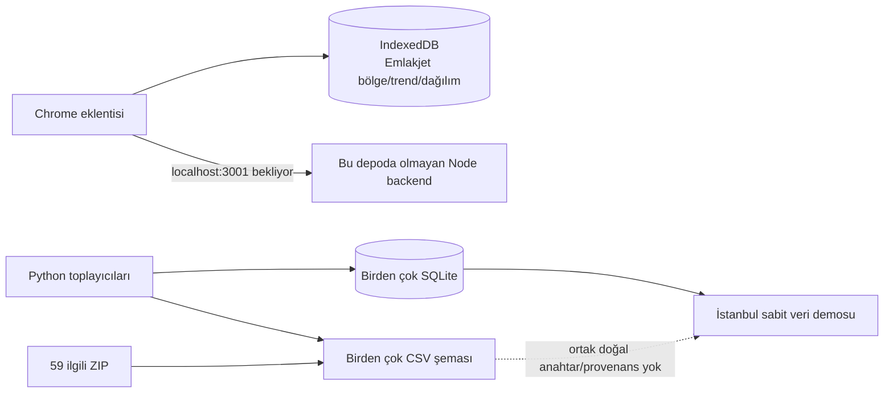
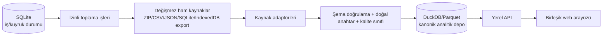

# GEOPROP veri ve araç envanteri — ilk teknik inceleme

Tarih: 2026-09-09

## İncelenen kapsam

- Ana depo: `/Users/acar/Downloads/extension`
- Parçalı veri/arşiv kaynağı: `/Users/acar/Downloads/Öğelerle Yeni Klasör 2`
- Eklentinin beklediği fakat bu depoda bulunmayan backend örneği:
  `/Users/acar/Desktop/tkgm`

Bu rapor canlı kaynakların bugün hâlâ aynı sözleşmeyle çalıştığını kanıtlamaz.
Canlı ağ uçları ayrıca sözleşme, izin, hız sınırı ve örnek yanıt testinden
geçirilmelidir.

## Sistem bugün nasıl parçalanmış?



Tek ürün yerine üç ayrı çalışma zamanı vardır:

1. Emlakjet bölge endeksini IndexedDB'de tutan Chrome eklentisi.
2. İlan, demografi, fiyat, POI, araç, lojistik, coğrafya ve parsel verisi
   üreten bağımsız Python betikleri.
3. Büyük ölçüde İstanbul'a sabitlenmiş `demo/` arayüzü ve yerel Python HTTP
   sunucusu.

Eklentinin ilan akışı `/api/ilanlar`, `/api/piyasa`, `/api/iller`,
`/api/ilceler` ve `/api/coz-adres` uçlarını bekler. Bunları sağlayan
`server.js` ile `package.json` bu depoda yoktur; ayrı `Desktop/tkgm`
klasöründedir.

## Veri envanteri

Makine-okunur tam tarama `reports/veri-envanteri.json` dosyasındadır. Rapor,
kalıcı açma/çıkarma yapmadan üretildi.

| Küme | Ölçülen durum |
| --- | --- |
| Depo büyüklüğü | yaklaşık 422 MB |
| Depodaki veri dosyaları | 55 CSV, 9 SQLite/DB, 1.061 JSON/GeoJSON |
| İlgili dış arşivler | 59 ZIP, ZIP içlerinde 419 CSV girişi |
| ZIP CSV satırları | tekrarlar dahil 5.990.691 satır |
| Poligon parçaları | 81 il + 973 ilçe dosyası, 52.151 poligon kaydı |
| Mahalle koordinat sözlüğü | 51.171 kayıt |
| Birleşik ana ZIP | 14 CSV, yaklaşık 2,45 milyon veri satırı |
| Ana ZIP kapsaması | 76 il; Batman, Şırnak, Ardahan, Iğdır ve Kilis eksik |
| Eksik iller | ayrı `m02`–`m06` ZIP'lerinde mevcut |
| Ana ZIP `iller` tablosu | 81 il x 15 tekrar = 1.215 satır |
| Tarayıcı Emlakjet dışa aktarımları | 19 CSV; bölge, trend ve dağılım şemaları |
| Yerel parsel DB | 20 parsel, 27 bağımsız bölüm, 0 askı kaydı |

Tamamen aynı üç ZIP çifti vardır:

- `bolge_01_istanbul.zip` ve `(1)` kopyası
- `bolge_04_bursa_yalova.zip` ve `(1)` kopyası
- `bolge_12_orta_anadolu.zip` ve `(1)` kopyası

`TUM_TURKIYE_TAMAMI_TEK_PAKET.zip` yalnızca
`TUM_TURKIYE_TEK_PAKET_CSV.zip` dosyasını tekrar saran bir ZIP'tir.

## Kritik bulgular

### P0 — İmar ve bağımsız bölüm verisi sentetikti

E-Plan isteği başarısız olduğunda motor her parsele `Konut Alanı`, KAKS 1.50,
TAKS 0.35, 5 kat, aynı PIN ve aynı tarihleri yazıyordu. Bağımsız bölüm sayısı
da parsel alanını 70'e bölerek üretiliyordu; buna rağmen kaynak alanında TKGM
sicili gibi sunuluyordu.

Mevcut parsel veritabanındaki 20 kaydın tamamı aynı KAKS, TAKS ve PIN değerini
taşıdığı için imar/plan/bağımsız-bölüm sütunları doğrulanmış veri olarak
kullanılmamalıdır. Kadastro geometrisi ve alanı ayrı değerlendirilebilir.

Kod artık kaynak başarısızlığında boş/doğrulanamadı değer döndürüyor ve
bağımsız bölüm üretmiyor. Eski 20 kayıt otomatik silinmedi; kanonik havuza
alınırken `karantina` sınıfında tutulmalıdır.

### P0 — Ana ZIP “81 il” değil

Birleşik ZIP'in temel tablolarında yalnız 76 il vardır. Eksik beş ilin ayrı
paketleri mevcut olsa da eski birleştirici ZIP içlerini doğrudan okumadığı için
ana pakete girmemiştir. Van ana pakette vardır; `m01_van.zip` daha kapsamlı bir
tamamlama paketidir.

### P0 — Eklentinin ilan backend'i eksik

Kurulum belgesi `PORT=3001 npm start` der; bu depoda npm projesi yoktur.
Eklentinin Emlakjet IndexedDB bölge akışı çalışabilir, fakat ilan/piyasa kayıt
akışı tek başına çalışamaz.

### P1 — Birleştirme doğal anahtar kullanmıyor

Mevcut `merge_csv.py`, ilk sütunu imzadan çıkarıp kalan bütün satırı karşılaştırır.
Toplanma zamanı değişince aynı coğrafya yeni kayıt sayılır. En görünür sonuç,
81 ilin 15 kez yinelenerek 1.215 satıra çıkmasıdır. Kaynak dosya, arşiv üyesi,
gözlem dönemi, toplama zamanı ve veri sınıfı da korunmamaktadır.

### P1 — “Güncel/resmî/eksiksiz” etiketleri veriyi aşmış

- Ticari istihbarat tablosunda birçok il adı `İl 2`, `İl 4` gibi üretilmiştir.
- ETBİS, SEGE, tütün ve ciro alanlarının önemli bölümü sabit katsayılarla
  modellenmiştir; canlı/resmî ölçüm değildir.
- İstanbul demosu bu değerleri “güncel” ve tüm veriyi resmî uçlardan derlenmiş
  gibi gösteriyordu.
- Ana fiyat özetinde 1.714 kayıt `2027-08` dönemindedir; özet tablosunda bunun
  projeksiyon olduğunu belirten alan yoktur.

Arayüzdeki kesinlik iddiaları yumuşatıldı; model değerleri açıkça türetilmiş ve
doğrulama gerektirir olarak etiketlendi.

### P1 — Çalıştırma güvenliği zayıftı

Bazı betikler `--help` verildiğinde bile ağı tarayıp dosya yazıyordu. Parsel
sayfası da açılışta örnek sorguyu otomatik başlatıp veritabanına kayıt yapıyordu.

İlk düzeltmeler:

- Coğrafya, mahalle-poligon ve ham-JSON araçlarında güvenli yardım/başlatma
  davranışı eklendi.
- Mahalle poligon ve geçmiş-JSON işleri açık `--calistir` ister.
- Demo derleyicisi kişisel sabit klasör yerine açık `--db`, `--poligon` ve
  `--cikti` yollarını kullanır; kaynak SQLite salt-okunur açılır.
- Ticari-istihbarat üreticisi ancak `--model-demo` ile çalışır ve yeni
  kayıtlarını `MODEL-*` dönemiyle etiketler.
- Parsel web API'si artık `persist=False` ile salt-okunur sorgular.
- Demo yalnız `127.0.0.1` üzerinde dinler.
- Parsel sayfası açılışta ağ isteği yapmaz.
- Bölgesel parsel işlerinin `--cikis-ek` veritabanı yerine yanlışlıkla ana DB'ye
  yazması düzeltildi; workflow artık keşfi açık bayrakla başlatır.

### P2 — Kod ve test organizasyonu

- 31 kaynak dosyada yaklaşık 11.500 satır kod vardır.
- Otomatik kalite taraması Python tarafında ortalama 58,6/F buldu; özellikle
  500+ satırlık, çok sorumluluklu dosyalar baskındır.
- `content.js` 1.077, `demo/app.js` 1.535, parsel motoru 800+ satırdır.
- Aynı dosyaların kök ve `collector/` kopyaları vardır.
- İnceleme öncesinde bu depoda test klasörü yoktu.

Eklenen güvenlik testleri sentetik imar üretilmemesini, web sorgusunun
kaydetmemesini, bölgesel DB hedefini ve veri envanterini doğrular.

## Önerilen hedef mimari

Bu ölçek ve ekip için mikroservis değil, sınırları net bir **modüler monolit**
uygundur.



Önerilen veri sınıfları:

- `observed`: kaynaktan gelen ham gözlem
- `derived`: formülü ve girdileri kayıtlı türetilmiş gösterge
- `projection`: geleceğe dönük tahmin
- `demo`: yalnız arayüz örneği
- `quarantine`: kaynağı/üretim biçimi güvenilmez eski kayıt

Her kanonik satır şu metadata'yı taşımalıdır:

- `source_name`
- `source_file` ve ZIP iç üye adı
- `source_url` (varsa)
- `observed_period`
- `collected_at`
- `quality_class`
- `natural_key`
- `ingest_run_id`
- `raw_hash`

Analitik sorgular için DuckDB + Parquet, yerel kuyruk/iş durumu için SQLite
uygundur. Çok kullanıcılı sunucu ihtiyacı doğarsa aynı kanonik şema PostgreSQL'e
taşınabilir.

## Uygulanabilir yol haritası

### Aşama 0 — güven ve karantina (başladı)

- Sentetik imar üretimini durdur.
- Eski parsel imar/bağımsız bölüm alanlarını karantinaya al.
- Hiçbir ağ işi kullanıcı eylemi veya açık CLI bayrağı olmadan başlamasın.

### Aşama 1 — kanonik envanter ve kaynak seçimi

- `tools/veri_envanteri.py` çıktısını veri kataloğunun temeli yap.
- ZIP'leri açmadan okuyabilen bir ingest planı oluştur.
- Her tablo için doğal anahtar tanımla.
- 15 bölge paketi + eksik il paketleri + POI/ofis paketleri + tarayıcı
  dışa aktarımlarının öncelik sırasını sabitle.

### Aşama 2 — kanonik veri ambarı

- Ham dosyalara dokunmadan yeni bir `warehouse/` üret.
- 81 il tekil olmalı; yinelenen paketler hash ile atlanmalı.
- Gözlem, model ve projeksiyon tabloları fiziksel olarak ayrılmalı.
- Poligonlar ilçe bazında tembel yüklenmeli; 375 MB tek seferde tarayıcıya
  gönderilmemeli.

### Aşama 3 — tek çalışma noktası

- Eklentinin eksik Node backend sözleşmesini depoya geri al veya aynı uçları
  yerel API'de uyumlu biçimde uygula.
- `inventory`, `import`, `validate`, `serve`, `collect` komutlarını tek CLI
  altında topla.
- Toplayıcı durumları, son başarılı çalışma, hata ve kaynak izni arayüzde
  görünür olsun.

### Aşama 4 — birleşik arayüz

- Türkiye → il → ilçe → mahalle araması
- Bölge özeti, fiyat serisi, demografi, POI, araç ve lojistik sekmeleri
- Ada/parsel için yalnız doğrulanmış kadastro; imar ayrı güven rozetiyle
- Her kartta kaynak, dönem, toplama tarihi ve veri sınıfı
- Eksik kapsama ve model değerleri için kalıcı uyarı

## Kabul ölçütleri

İlk kullanılabilir sürüm ancak şu koşullarla tamamlanmış sayılmalı:

1. Tek komutla yerel servis açılır; eklenti backend'i ayrıca aranmaz.
2. Kanonik `iller` tablosu tam 81 tekil il içerir.
3. ZIP, doğrudan CSV ve SQLite kaynakları aynı doğal anahtar sözleşmesiyle
   tekrar üretilebilir biçimde içe alınır.
4. Her sayı `observed`, `derived`, `projection`, `demo` veya `quarantine`
   sınıfından birini taşır.
5. Kaynak hatasında imar hakkı, bağımsız bölüm veya resmî istatistik üretilmez.
6. Kullanıcı eylemi olmadan ağ taraması veya kalıcı yazma başlamaz.
7. Birim testleri, şema testleri ve en az bir gerçek yerel kullanıcı akışı
   testi geçer.

## Komutlar

Salt-okunur envanter:

```bash
python3 tools/veri_envanteri.py collector/data /veri/paketleri \
  --zip-csv-satirlari --hashes --output reports/veri-envanteri.json
```

Mevcut güvenlik testleri:

```bash
python3 -m unittest discover -s tests -v
```
