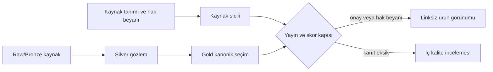

# ADR-0002: Kaynak Sicili, Veri Hakları ve Yayın Kapısı

- Durum: Kabul edildi; kullanıcı yayın hakkı beyanı etkin, yasal hak sahibi adı bekleniyor
- Tarih: 11 Eylül 2026
- Karar sürümü: `source-registry-v1.1.0`

## Bağlam

Silver katmanında 2.890 kaynak birimi ve 9.140.813 kayıp olmadan korunmuş kayıt
bulunuyor. Kullanıcı, istatistiksel modelleri ve veri araştırmasını kendisinin
yaptığını beyan etti. Bununla birlikte yerel dosyaların bir bölümü internet
siteleri, harita servisleri veya kamu kurumlarının kayıtlarından türemiştir.

5846 sayılı Kanunun veri tabanı yapımcısına ilişkin koruması; veri tabanının
oluşturulması, doğrulanması veya sunumuna yapılan esaslı yatırımı koruyabilir.
Bu koruma upstream içerikteki üçüncü taraf haklarını otomatik olarak devralmaz.
Kaynakların sözleşmesel koşulları ayrıca uygulanır. Örneğin OpenStreetMap verisi
ODbL atıf ve paylaşım şartlarına, EmlakJet verisi kendi kullanım koşullarına
tabidir.

## Karar

1. Kullanıcının özgün istatistiksel modeli, model çıktıları, şeması, kalite
   kuralları ve veri tabanı düzeni `PROPRIETARY-DATA-1.0` altında tanımlanır.
2. Yasal hak sahibi alanı gerçek kişi adı veya şirket unvanı girilene kadar
   taslak durumundadır.
3. Üçüncü taraf ham içerikler kullanıcı mülkiyet iddiasının dışında tutulur ve
   sağlayıcı bazlı lisans/koşul kanıtı ister.
4. Her Silver kaynak birimi tam olarak bir `source_id` ile eşleştirilir.
5. Gold kanonik seçim ile ürün yayını ayrılır. Kanonik satırın bulunması onun
   yayımlanabilir olduğu anlamına gelmez.
6. Bir kaynak `registry_status in (approved, owner_rights_declared)` ve
   `license_status in (verified, user_owned_verified,
   user_publication_rights_declared)` olduğunda yayın veya değerleme girdisi
   görünümüne geçebilir.
7. Son kullanıcı API ve arayüzlerinde kaynak/ilan URL'si gösterilmez. İçerik
   karması, kaynak tablosu ve gözlem soy ağacı iç denetimde korunur.
8. TKGM canlı sorguları ve çoklu harita POI sorguları dosya kaynaklarından ayrı
   kaydedilir; sorgu zamanı ve sağlayıcı kanıtı olmadan kalıcı kanonik değer
   üretmez.

## Akış

## Güvenli başlangıç durumu

- Kullanıcı üretimi model çıktıları: sahiplik beyanı vardır ve ürün kullanımına
  açıktır; yasal ad/unvan lisans bildiriminde hâlâ doldurulmalıdır.
- Sicilde yayın hakkı beyan edilmiş kayıtlar: ürün görünümüne açıktır, ancak
  kullanıcıya kaynak veya ilan bağlantısı verilmez.
- Kısıtlı bağlam verileri: fiyatlama, konut uygunluğu, hedefleme ve reklamdan
  daima hariç.
- Çoklu POI: sağlayıcı bazında ayrılana kadar skorlamadan hariç.
- TKGM: canlı, istek bazlı ve kanıt zamanlı; resmî imar alanı gibi sunulmaz.

## Sonuçlar ve ödünleşimler

- Avantaj: Kullanıcıya ait fikrî yatırım görünür ve lisanslanabilir hâle gelir.
- Avantaj: Bir üçüncü taraf kaynak belgesi geldiğinde tüm veri hattını yeniden
  yazmadan yalnız sicil kararı değiştirilebilir.
- Avantaj: Kaynak izni bulunmayan satır yanlışlıkla ürün API'sine çıkamaz.
- Maliyet: Kullanıcı beyanı bağımsız hukuki doğrulamanın yerine geçmez; sicil
  kararı ve beyan tarihi denetlenebilir tutulmalıdır.
- Maliyet: Aynı POI veya ilan kümesindeki farklı upstream sağlayıcılar satır
  seviyesinde ayrıca ayrıştırılmalıdır.

## Uygulama kanıtı

- `config/kaynak_sicili_tanimlari.json`
- `reports/kaynak-sicili.json`
- `warehouse/gold/gold-manifest.json`
